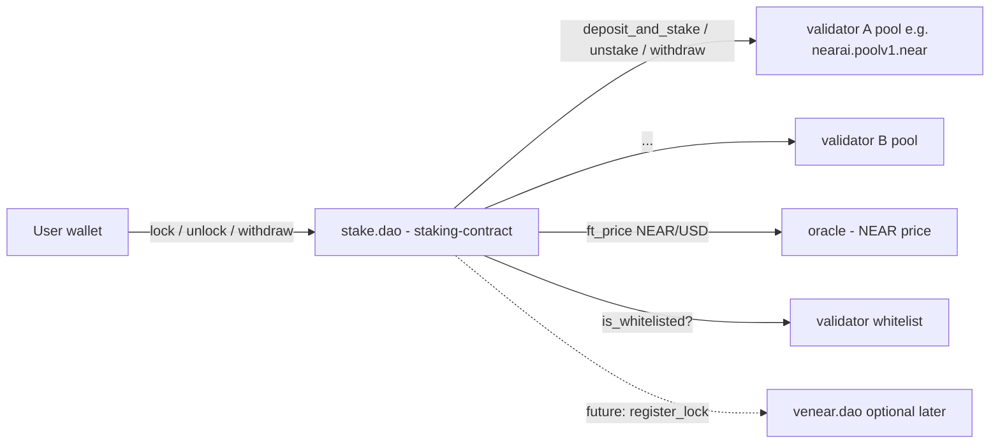

# Staking Contract — Detailed Design

The plan below specifies the on-chain design of the new contract that lives at [house-of-stake-contracts/staking-contract/](house-of-stake-contracts/staking-contract/). It is intentionally written so the `README.md` in that folder can be replaced with this content (or distilled into it) in the implementation step. No code is written yet.

## 1. Goals and non-goals

Goals:
- Allow a NEAR account (the "staker") to purchase a NEAR AI product or subscribe to a plan by **locking** NEAR for a chosen duration. The locked NEAR is staked into the product's validator pool; the validator's commission funds the product (typically 100% commission on `nearai.poolv1.near`).
- Be the single on-chain entrypoint for NEAR AI billing: products, prices, subscriptions, locks.
- Use a pooled meta-validator model: `stake.dao` is the only delegator on each whitelisted validator pool; per-user accounting is internal via shares.
- Be governed by HoS DAO (initially a security multisig), upgradable in the same pattern as the sibling contracts.
- Share patterns/types with the existing workspace ([house-of-stake-contracts/common/](house-of-stake-contracts/common/), [lockup-contract/](house-of-stake-contracts/lockup-contract/), [venear-contract/](house-of-stake-contracts/venear-contract/)).

Non-goals (for v1):
- Granting veNEAR voting power for `stake.dao` locks (kept independent of `venear-contract`; can be added later via a "register lock with veNEAR" hook).
- Liquid staking tokens (no fungible share token issued; shares are internal).
- Cross-validator rebalancing / autocompounding (stake stays where the user purchased).
- On-chain credit redemption — "credits" are an off-chain billing concept driven by `lock` events.

## 2. System architecture



Key roles:
- **Contract owner** — HoS DAO (initially a multisig). Onboards validators (adds them to the on-contract allowlist), assigns each validator's owner, sets oracle/operators/global parameters, upgrades the contract.
- **Guardians** — can pause the contract (same pattern as [venear-contract/src/pause.rs](house-of-stake-contracts/venear-contract/src/pause.rs)).
- **Operator(s)** — drive `epoch_stake`/`epoch_unstake`/`epoch_withdraw`. Restricted by `Config.operators` (empty list ⇒ permissionless).
- **Validator owner** (e.g., `nearai.sputnik-dao.near`) — owner of an on-contract `Validator` entry. Manages that validator's products and prices on stake.dao, and (separately, off this contract) controls the underlying staking pool itself (commission, etc.). The contract owner does **not** manage products/prices.
- **Stakers** — end users buying products/subscriptions.

## 3. Crate layout

Add a new crate inside the workspace mirroring sibling crates. Suggested files (all under [house-of-stake-contracts/staking-contract/src/](house-of-stake-contracts/staking-contract/src/)):

- `lib.rs` — `Contract` state, `#[init]`, ext interfaces (`ext_staking_pool`, `ext_oracle`, `ext_self`).
- `config.rs` — `Config` (owner, guardians, oracle, fees, durations), `get_config`, propose/accept ownership.
- `governance.rs` — contract-owner setters (`set_*`, `propose_new_owner_account_id`, `accept_ownership`), `assert_owner`, `assert_guardian`, `assert_validator_owner(validator_id)`.
- `pause.rs` — `pause`/`unpause`/`is_paused` (port [venear-contract/src/pause.rs](house-of-stake-contracts/venear-contract/src/pause.rs)).
- `upgrade.rs` — `upgrade()` extern + `migrate_state` (port [venear-contract/src/upgrade.rs](house-of-stake-contracts/venear-contract/src/upgrade.rs)).
- `validators.rs` — `Validator` model and the on-contract validator allowlist (the `validators` map itself); `add_validator`/`pause_validator`/`remove_validator`/`set_validator_owner`/`list_validators`; share-pool math per validator.
- `products.rs` — `Product`, `Price`, lifecycle (`create_product`, `edit_product`, `archive_product`, `delete_product`, plus parallel `*_price` methods). All gated by `assert_validator_owner` for the product's validator.
- `subscriptions.rs` — `Subscription` model and lookup helpers.
- `oracle.rs` — `ext_oracle` trait, `OraclePrice`, `set_oracle_account_id`, USD→NEAR conversion helpers (with min/max sanity bounds).
- `accounts.rs` — `Account` (per-user balances, locks, share holdings), storage deposit pattern (NEP-145).
- `ids.rs` — Stripe-style identifier wrappers (`ProductId`, `PriceId`, `SubscriptionId`, `LockId`) plus deterministic on-chain ID generator.
- `lock.rs` — `lock_for_product`, `lock_for_subscription`, internal "create order + take payment + record lock + accrue shares".
- `unlock.rs` — `unlock(lock_id)`, user-initiated only (Solution 1).
- `withdraw.rs` — user `withdraw` (after pool's 4-epoch settlement returns NEAR to `stake.dao`).
- `epoch.rs` — `epoch_stake(validator_id)`, `epoch_unstake(validator_id)`, `epoch_withdraw(validator_id)`, `refresh_validator_balance(validator_id)` (mirrors [lockup-contract/src/owner.rs](house-of-stake-contracts/lockup-contract/src/owner.rs)).
- `pool_callbacks.rs` — `on_*` callbacks for staking pool external calls.
- `events.rs` — `EVENT_JSON` emitters for product/price/subscription/lock/unlock/withdraw (extends pattern from [common/src/events.rs](house-of-stake-contracts/common/src/events.rs)).
- `gas.rs` — gas constants per external call (mirrors [lockup-contract/src/gas.rs](house-of-stake-contracts/lockup-contract/src/gas.rs)).
- `types.rs` — `Currency`, `PriceType`, `BillingPeriod`, `OrderRef`, `LockStatus`, `CatalogStatus`, `SubscriptionStatus`, `ValidatorStatus`, `TransactionStatus`.

`Cargo.toml` mirrors the [voting-contract/Cargo.toml](house-of-stake-contracts/voting-contract/Cargo.toml) reproducible-build header; depends on `common`, `near-sdk`, `serde_json`. The crate is added to the workspace `members` and to `build_all.sh` / `test_all.sh`.

## 4. Data model

### 4.1 Top-level state

```rust
#[near(contract_state)]
pub struct Contract {
    config: Config,
    paused: bool,

    // The on-contract validator allowlist. Only validators present here can host products.
    validators: UnorderedMap<AccountId, Validator>,

    // Catalog (Stripe-style string IDs)
    products: UnorderedMap<ProductId, Product>,
    prices: UnorderedMap<PriceId, Price>,

    // Customers
    accounts: LookupMap<AccountId, Account>,

    // Subscriptions and locks (Stripe-style string IDs)
    subscriptions: UnorderedMap<SubscriptionId, Subscription>,
    locks: LookupMap<LockId, Lock>,

    // Monotonic nonces feeding the deterministic Stripe-style ID generator (see §4.6).
    id_nonce: u64,
}
```

### 4.2 Config

```rust
pub struct Config {
    pub owner_account_id: AccountId,
    pub proposed_new_owner_account_id: Option<AccountId>,
    pub guardians: Vec<AccountId>,
    pub operators: Vec<AccountId>,
    pub oracle_account_id: AccountId,
    pub oracle_max_age_ns: U64,
    pub min_lock_duration_ns: U64,
    pub max_lock_duration_ns: U64,
    pub epoch_unstake_settle_epochs: u64,
    pub min_storage_deposit: NearToken,
    pub min_lock_amount: NearToken,
}
```

The validator allowlist is the contract-internal `validators: UnorderedMap<AccountId, Validator>` map. It is unrelated to the HoS staking pool whitelist used by [lockup-contract](house-of-stake-contracts/lockup-contract/) — that whitelist controls which pools any user can stake their lockup to, while stake.dao's allowlist controls which validator pools can list NEAR AI products.

### 4.3 Validator (the meta-validator's accounting per pool)

`stake.dao` is a single delegator on each pool. To split rewards/principal fairly across users, each user holds `shares` for that validator; `total_staked_balance / total_shares` converts shares↔NEAR. Locks reserve a portion of those shares from being unstaked early.

```rust
pub struct Validator {
    pub pool_account_id: AccountId,
    pub owner_account_id: AccountId,         // manages products/prices for this validator
    pub status: ValidatorStatus,             // Active | Paused | Removed

    pub total_shares: U128,                  // contract-level total shares for this validator
    pub total_staked_balance: NearToken,     // last known principal+rewards held in the pool
    pub last_balance_refresh_ns: U64,

    pub pending_to_stake: NearToken,
    pub pending_to_unstake: NearToken,
    pub last_unstake_epoch: u64,
    pub pending_to_withdraw: NearToken,

    pub tx_status: TransactionStatus,        // Idle | Busy
}
```

Share math (per-validator):
- `shares_for(amount) = amount * total_shares / total_staked_balance` (or 1:1 when pool is empty).
- `near_for(shares) = shares * total_staked_balance / total_shares`.
- `total_staked_balance` for share math includes `pending_to_stake` so existing rewards aren't diluted toward new joiners between `lock` and `epoch_stake`.
- `total_staked_balance` is updated on every confirmed pool deposit/withdraw/refresh callback so existing shares revalue with rewards (and slashes).

`Validator.total_shares` is the canonical contract-level total for that validator and the **denominator** for every share-math computation. It is maintained as an invariant against the per-account view:

```text
sum over accounts a of  a.shares_by_validator[v]  ==  validators[v].total_shares
```

A view method `get_validator(validator_id) -> Validator` (and a paginated `list_validators`) exposes it for off-chain consumers and for unit tests that assert the invariant after each mutation.

### 4.4 Product / Price / Subscription

```rust
pub enum Currency { Near, Usd }
pub enum PriceType { OneOff, Recurring }
pub enum BillingPeriod { Monthly /* Yearly later */ }

// Stripe-style identifier wrappers (see §4.6 for format and generation).
// Examples: "prod_U0oGl1t1RHksee", "price_1T2meCP9GakuUz2YCwLJL3qG",
//           "sub_3Nq7s2P9Gak0Uz2Y", "lock_4Mp1z9P9GakuUz2Y".
#[derive(Clone, Hash, PartialEq, Eq)]
#[near(serializers=[borsh, json])]
pub struct ProductId(pub String);
pub struct PriceId(pub String);
pub struct SubscriptionId(pub String);
pub struct LockId(pub String);

pub struct Product {
    pub product_id: ProductId,
    pub validator_id: AccountId,
    pub name: String,
    pub description: String,
    pub status: CatalogStatus, // Active | Archived
    pub created_ns: U64,
    pub price_ids: Vec<PriceId>,
    pub usage_count: u64,
}

pub struct Price {
    pub price_id: PriceId,
    pub product_id: ProductId,
    pub name: String,
    pub description: String,
    pub currency: Currency,
    pub amount: U128,
    pub price_type: PriceType,
    pub billing_period: Option<BillingPeriod>,
    pub lock_factor_near_months: U128,
    pub status: CatalogStatus,
    pub usage_count: u64,
}

pub struct Subscription {
    pub subscription_id: SubscriptionId,
    pub account_id: AccountId,
    pub product_id: ProductId,
    pub price_id: PriceId,
    pub start_ns: U64,
    pub end_ns: U64,
    pub anchor_day: u8,           // calendar-day anchor (1..=31), used for monthly extension
    pub last_lock_id: LockId,
    pub status: SubscriptionStatus, // Active | Cancelled | Expired
}
```

Hybrid pricing rule (per "hybrid" choice):
- If `Price.currency == Near`, `required_near_months = amount * lock_factor_near_months / 1_NEAR`.
- If `Price.currency == Usd`, snapshot oracle on lock: `near_per_usd = oracle_price.near_per_usd`, then `required_near_months = amount_usd * near_per_usd * lock_factor_near_months`.
- The snapshot is frozen on the resulting `Lock`; subsequent oracle moves do not change the lock requirement.
- The user submits `(amount_near, duration_months)` and the contract enforces `amount_near * duration_months >= required_near_months` (strict integer math with milliNEAR truncation, similar to [common/src/types.rs](house-of-stake-contracts/common/src/types.rs)).

### 4.5 Account & Lock

```rust
pub struct Account {
    pub account_id: AccountId,
    pub storage_deposit: NearToken,

    pub shares_by_validator: UnorderedMap<AccountId, U128>,

    pub active_lock_ids: Vec<LockId>,

    pub withdrawable_balance: NearToken,
}

pub struct Lock {
    pub lock_id: LockId,
    pub account_id: AccountId,
    pub validator_id: AccountId,
    pub amount_near: NearToken,
    pub shares: U128,
    pub start_ns: U64,
    pub end_ns: U64,
    pub order: OrderRef, // ProductPurchase{product_id, price_id} | Subscription{subscription_id, price_id, period_start_ns, period_end_ns}
    pub status: LockStatus, // Active | UnlockRequested(at_ns) | Withdrawn
}
```

`shares` are minted **at lock time** out of the validator's pool and assigned to the user's `shares_by_validator[validator_id]`. The lock "reserves" that many shares from being unstaked before `end_ns`. Multiple concurrent locks on the same validator simply add to the user's share total; the contract enforces "free shares (not held by any unexpired lock) are the only ones that can be unlocked early" by tracking the sum of `lock.shares` per user-per-validator with `lock.status == Active`.

### 4.6 Stripe-style identifier format

All catalog and lifecycle identifiers follow Stripe's prefixed-base62 layout so they can be reused 1:1 in the off-chain billing system without translation:

- `Product`     → `prod_<base62>` (e.g. `prod_U0oGl1t1RHksee`)
- `Price`       → `price_<base62>` (e.g. `price_1T2meCP9GakuUz2YCwLJL3qG`)
- `Subscription`→ `sub_<base62>`
- `Lock`        → `lock_<base62>`

Generation (deterministic, on-chain, no RNG dependency):

```text
nonce := contract.id_nonce; contract.id_nonce += 1
seed  := sha256( prefix || u64_be(nonce) || u64_be(env::block_height())
              || u64_be(env::block_timestamp()) || env::predecessor_account_id().as_bytes() )
suffix := base62_encode(seed)[0..N]   // N = 14 for prod, 24 for price (matches Stripe), 17 for sub/lock
id     := prefix || "_" || suffix
```

Notes:
- `id_nonce` (in §4.1) guarantees uniqueness even within the same block.
- The hash inputs include `predecessor_account_id` so that two parallel `lock` transactions in the same block by different users do not collide on the same hash.
- Charset is the canonical base62 (`0-9A-Za-z`) for visual parity with Stripe's IDs.
- Suffix length is configurable per type but fixed once the contract launches to avoid downstream parsers breaking.

## 5. Lifecycle flows

### 5.1 Locking for a one-off product purchase (`lock_for_product`)

```mermaid
sequenceDiagram
    participant User
    participant StakeDao as stake.dao
    participant Oracle as price oracle

    User->>StakeDao: lock_for_product(price_id, duration_ns) attached_deposit=N NEAR
    StakeDao->>StakeDao: assert_not_paused; load Price; load Product; assert validator Active
    alt Price.currency == Usd
        StakeDao->>Oracle: get_price()
        Oracle-->>StakeDao: near_per_usd, ts
        StakeDao->>StakeDao: assert ts fresh; compute required_near_months
    else Near
        StakeDao->>StakeDao: required_near_months = amount * factor
    end
    StakeDao->>StakeDao: require N * duration_months >= required_near_months
    StakeDao->>StakeDao: mint shares for N at validator (using last total_staked_balance + pending_to_stake)
    StakeDao->>StakeDao: account.shares_by_validator[v] += shares
    StakeDao->>StakeDao: persist Lock; validator.pending_to_stake += N
    StakeDao->>StakeDao: emit lock event; return lock_id
```

Notes:
- The actual `deposit_and_stake` to the pool happens later in `epoch_stake(validator)` to amortize gas across users in the same epoch.
- USD-priced lock is a 2-step xcc (oracle call + self callback that creates the lock); the 1 yocto + attached NEAR are held in a temporary "pending order" map keyed by `(account_id, nonce)` until the callback resolves, refunded on failure.

### 5.2 Locking for a subscription (`lock_for_subscription`)

- Caller passes `(price_id, months)` with `Price.price_type == Recurring`.
- Contract creates a new `Subscription` (or extends an existing active one for the same price), pinning `Subscription.anchor_day = day_of_month(start_ns)` on creation, then extends and creates a corresponding `Lock`.
- Calendar-month extension (Stripe-compatible):

  ```text
  let base = max(now, subscription.end_ns)
  let (y, m, _d) = utc_year_month_day(base)
  let target_year_month = (y, m + months)            // overflow into year as needed
  let day = min(subscription.anchor_day, last_day_of_month(target_year_month))
  let new_end_ns = utc_to_ns(target_year_month, day, time_of_day(base))
  ```

  - The day-of-month is preserved across extensions (Jan 15 → Feb 15 → Mar 15 …).
  - When the target month has fewer days than `anchor_day` (e.g., Jan 31 + 1 month), the date snaps to the last day of that month (Feb 28/29). The original `anchor_day` is never overwritten by this clamping, so the next extension can return to the anchor (Feb 28 + 1 month = Mar 31 if the anchor is 31).
- The actual lock duration of this top-up is `new_end_ns - sub.end_ns_before` (not `months * 30 days`), and the price-formula check uses **this** as `duration_months_equivalent = (new_end_ns - sub.end_ns_before) / avg_month_ns` with `avg_month_ns = 30.4375 * 86_400 * 1e9` (Stripe's average month length) so users are charged consistently regardless of which months are crossed.
- Subscription's `end_ns` is moved forward to `new_end_ns` per top-up lock; cancellation is implicit (just don't top up).
- Same share-minting and `pending_to_stake` accounting as one-off purchases.

### 5.3 Unlocking (`unlock`) — Solution 1 only

Only the user-driven flow is supported. There is no operator sweep, no `operator_unlock_due`.

- `unlock(lock_id)` is callable by `lock.account_id` once `now >= lock.end_ns`.
- The contract refreshes the validator's `total_staked_balance` first (or asserts a recent enough `last_balance_refresh_ns`) so share→NEAR conversion captures any rewards accrued since the lock was created.
- It then marks `lock.status = UnlockRequested`, frees `lock.shares` from the user's reserved-shares total, and converts those shares to `near_amount = near_for(shares, validator)`, which is added to `validator.pending_to_unstake` and to a per-user `pending_unstake_near` counter.

Why Solution 1 (not an operator sweep): keeping unlock user-initiated leaves room for **future per-validator reward sharing** without protocol changes. Some validators may run with <100% commission, and rewards earned over the lock period naturally accrue to the user's shares; with Solution 1 the conversion to NEAR happens at unlock time so the user automatically receives any shared rewards (and bears any slashing) that occurred during the lock. An operator sweep would either need extra bookkeeping to credit the same rewards to the right user or would have to lock the share→NEAR rate at `end_ns`, which forecloses that flexibility. It also avoids the operator becoming a liveness dependency for users to receive their funds.

After unlock, NEAR is unavailable until two epoch jobs run: `epoch_unstake` (sends `unstake` to the pool) and after the pool's 4-epoch settlement, `epoch_withdraw` (calls `withdraw_all` on the pool). The contract increments user `withdrawable_balance` only after the `epoch_withdraw` callback succeeds, proportional to the per-user `pending_unstake_near` snapshot.

### 5.4 Withdraw (`withdraw`)

User calls `withdraw(amount?)`. Transfers up to `account.withdrawable_balance` to the user via `Promise::new(account_id).transfer(amount)` and decrements the balance in the callback (only on success).

### 5.5 Operator: `epoch_stake(validator_id)`

```mermaid
sequenceDiagram
    participant Op as operator
    participant SD as stake.dao
    participant P as validator pool

    Op->>SD: epoch_stake(v)
    SD->>SD: assert_not_paused; v.tx_status == Idle; pending_to_stake > 0
    SD->>SD: amount = pending_to_stake; set tx_status = Busy
    SD->>P: deposit_and_stake() attach amount
    P-->>SD: ok
    SD->>SD: on_pool_deposit_and_stake_callback(v, amount)
    SD->>SD: total_staked_balance += amount; pending_to_stake -= amount; tx_status = Idle
```

`epoch_unstake(validator_id)` mirrors this, calling `unstake(amount)` and bumping `last_unstake_epoch = env::epoch_height()`.

`epoch_withdraw(validator_id)` checks `env::epoch_height() >= last_unstake_epoch + epoch_unstake_settle_epochs`, calls `withdraw_all`, and on success moves NEAR from "in-pool unstaked" into per-user `withdrawable_balance` proportional to each user's `pending_unstake_near` snapshot taken at unlock time.

`refresh_validator_balance(validator_id)` calls `get_account_total_balance` on the pool and updates `total_staked_balance` in the callback (rewards accrual). Safe to call by anyone; rate-limited by `last_balance_refresh_ns`.

## 6. Owner / governance methods

Two distinct roles. The contract owner administers the protocol; each validator owner administers only their own validator's products and prices. All methods follow the 1-yocto pattern from [venear-contract/src/governance.rs](house-of-stake-contracts/venear-contract/src/governance.rs).

### 6.1 Contract-owner methods (`assert_owner`)

- `propose_new_owner_account_id`, `accept_ownership`.
- `set_guardians`, `set_operators`.
- `set_oracle(account_id, max_age_ns)`.
- `set_lock_bounds(min_ns, max_ns)`, `set_min_lock_amount`, `set_min_storage_deposit`.

Validator allowlist (contract owner only):
- `add_validator(pool_account_id, validator_owner_account_id)` — synchronous; inserts a new entry into the on-contract `validators` map with `total_shares = 0`, `status = Active`, and `owner_account_id = validator_owner_account_id`. There is no external whitelist call (the on-contract `validators` map is itself the allowlist; see §4.2).
- `set_validator_owner(pool_account_id, new_owner)` — contract owner can rotate a validator's owner (e.g., after a SputnikDAO migration).
- `pause_validator(pool_account_id)` — flips `status = Paused`; no new locks; existing locks unchanged.
- `remove_validator(pool_account_id)` — flips `status = Removed`; permitted only when `total_shares == 0 && pending_to_stake == 0 && pending_to_unstake == 0 && pending_to_withdraw == 0`. (Resolves the README "TODO: handle the validators removed from whitelist".)

### 6.2 Validator-owner methods (`assert_validator_owner(validator_id)`)

These are the **only** callers allowed to manage the catalog for their validator. The contract owner cannot call them.

Catalog:
- `create_product(validator_id, name, description) -> ProductId`
- `edit_product(product_id, name, description)` — only `name`, `description` are mutable.
- `archive_product(product_id)`
- `delete_product(product_id)` — requires `usage_count == 0`.
- `create_price(product_id, currency, amount, price_type, billing_period, lock_factor_near_months) -> PriceId`
- `edit_price(price_id, name, description)` — only `name`, `description` are mutable.
- `archive_price(price_id)`
- `delete_price(price_id)` — requires `usage_count == 0`.

Once a Price has been used (any Lock references it), it is immutable except for archival/edit-of-display-fields, ensuring stable accounting. `assert_validator_owner` looks up `Product.validator_id` (or `Price.product_id → Product.validator_id`) and checks `predecessor_account_id == validators[validator_id].owner_account_id`.

## 7. External interfaces

```rust
#[ext_contract(ext_staking_pool)]
pub trait ExtStakingPool {
    fn deposit_and_stake(&mut self);
    fn unstake(&mut self, amount: NearToken);
    fn withdraw_all(&mut self);
    fn get_account_total_balance(&self, account_id: AccountId) -> NearToken;
    fn get_account_unstaked_balance(&self, account_id: AccountId) -> NearToken;
}

#[ext_contract(ext_oracle)]
pub trait ExtOracle {
    fn get_price(&self) -> OraclePrice;
    fn get_price_30d_avg(&self) -> OraclePrice;
}
```

There is no `ext_whitelist`: the validator allowlist is internal to stake.dao and validated synchronously inside `add_validator`.

`OraclePrice { near_per_usd: Fraction, timestamp_ns: U64 }` reuses [common/src/types.rs](house-of-stake-contracts/common/src/types.rs) `Fraction` for safe rational math.

## 8. Storage and gas budgeting

- Storage deposit: NEP-145-style `storage_deposit` / `storage_withdraw` for accounts; `Config.min_storage_deposit` covers `Account` + a couple of `Lock` slots; additional locks that exceed the prepaid storage panic with a "top up storage" error.
- Catalog (`Product`, `Price`) storage is owner-paid (owner attaches deposit on create).
- Gas constants modeled on [lockup-contract/src/gas.rs](house-of-stake-contracts/lockup-contract/src/gas.rs): `BASE_GAS = 25 TGas`. New constants:
  - `EPOCH_DEPOSIT_AND_STAKE = 3 * BASE_GAS`, `EPOCH_UNSTAKE = 3 * BASE_GAS`, `EPOCH_WITHDRAW = 3 * BASE_GAS`.
  - `ORACLE_GET_PRICE = BASE_GAS`, callback `BASE_GAS`.
- All multi-step pool operations gate on `Validator.tx_status == Idle` and flip to `Busy` exactly like [lockup-contract/src/owner.rs](house-of-stake-contracts/lockup-contract/src/owner.rs).

## 9. Events

Extend [common/src/events.rs](house-of-stake-contracts/common/src/events.rs) (new module, standard `"stakedao"`, version `"1.0.0"`):
- Catalog: `product_create`, `product_edit`, `product_archive`, `product_delete`, `price_create`, `price_edit`, `price_archive`, `price_delete`.
- Validators: `validator_add`, `validator_pause`, `validator_remove`.
- Lifecycle: `lock_create` (with `lock_id`, `account_id`, `validator_id`, `amount`, `duration_ns`, `order`, frozen `near_per_usd` if USD-priced), `unlock_request`, `unlock_settled`, `withdraw`.
- Subscription: `subscription_create`, `subscription_extend`.
- Operations: `epoch_stake`, `epoch_unstake`, `epoch_withdraw`, `validator_balance_refresh`.

## 10. Security and edge cases

- All state-mutating user/owner endpoints are `#[payable]` with `assert_one_yocto()` (function-call key safety) except `epoch_*` (protected by `assert_operator`-or-empty and don't move user-controlled funds).
- All catalog/owner methods follow the 1-yocto pattern in [venear-contract/src/governance.rs](house-of-stake-contracts/venear-contract/src/governance.rs).
- `assert_not_paused` on every user-facing entrypoint.
- Validator status transitions guarded so a `Removed` validator can never serve new locks but existing locks can still be unlocked/withdrawn through it.
- Slashing is tolerated: `total_staked_balance` only decreases via `refresh_validator_balance` callback, share holders share the loss proportionally (standard staking pool semantics). Locks remain valid by share count, but `near_for(shares)` decreases — explicit risk disclosure in README.
- Reentrancy avoided via the `Idle/Busy` per-validator status flag.
- USD price freshness enforced (`now - price.timestamp_ns <= oracle_max_age_ns`); USD locks panic if oracle is stale rather than using a default.
- Integer-overflow safety with `U256/U384` (already in `common`) for `shares * staked_balance` math.

## 11. Open items to confirm during implementation

1. **`lock_factor_near_months`** units & decimals — proposed: store factor with denominator `1e21` (milliNEAR resolution). Confirm with billing team using one worked example before coding.
2. **Subscription month length** — **decided: calendar months, Stripe-anchored** (see §5.2). Open sub-question: confirm `avg_month_ns = 30.4375 days` as the divisor for the price-formula `duration_months_equivalent` on top-ups, or use the exact `(new_end_ns - old_end_ns)` in nanoseconds with the price factor expressed in NEAR-nanoseconds.
3. **Operator allowlist** — empty (permissionless) by default vs initial NEAR AI ops accounts. Default proposed: permissionless with rate-limit on `epoch_*` (one call per validator per epoch).
4. **veNEAR integration** — deferred to v2; designed-in seam: emit a `lock_create`/`unlock_settled` event the veNEAR side can consume, plus reserve a `register_with_venear: bool` field on `Lock`.
5. **Validator allowlist source** — **decided: stake.dao maintains its own internal allowlist** (the `validators` map). It is unrelated to the HoS staking pool whitelist consumed by the lockup contract. The contract owner adds entries via `add_validator(pool_account_id, validator_owner_account_id)`; once added, the validator owner manages products/prices for that validator (see §6).
6. **Stripe ID suffix lengths** — proposed: 14 chars for `prod_`, 24 chars for `price_`, 17 chars for `sub_`/`lock_` (matches Stripe's observed lengths). Confirm before launch since they are externally observable and parsers may rely on length.

## 12. Testing strategy

- Unit tests inside each module using `near_sdk::testing_env!` (mirrors [lockup-contract/src/lib.rs](house-of-stake-contracts/lockup-contract/src/lib.rs) tests) for share math, hybrid pricing, lock-amount-vs-duration enforcement, oracle freshness.
- Integration tests under `house-of-stake-contracts/integration-tests/` against `sandbox-staking-whitelist-contract` (existing) plus a small mock oracle WASM. Scenarios:
  - Owner setup → add validator → create product+price → user `lock` → operator `epoch_stake` → time skip → `unlock` → operator `epoch_unstake` → epoch skip → operator `epoch_withdraw` → user `withdraw`.
  - USD-priced product with stale oracle → lock panics.
  - Slashed pool reduces `total_staked_balance` → `near_for(shares)` decreases for all users proportionally.
  - Recurring subscription extension over multiple `lock` calls.
  - Validator removal blocked while shares outstanding.
- Add `staking-contract` to `build_all.sh` and `test_all.sh`.
