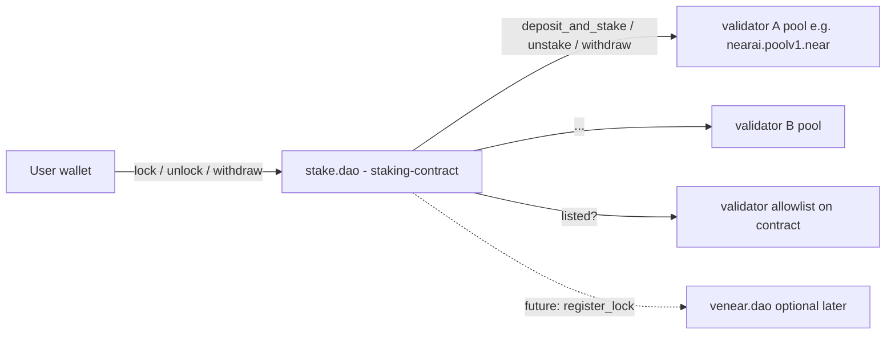

# Staking Contract — Detailed Design

This document is the design reference for `stake.dao` (the `staking-contract` crate). Implementation may evolve; see [README.md](../README.md), [features/lazy-epoch-pipeline.md](features/lazy-epoch-pipeline.md) (authoritative for validator pool scheduling), and [operations/production-readiness.md](operations/production-readiness.md) for scope and status.

---

The following sections specify the on-chain design of the contract in the [staking-contract](../) crate. This doc is written so [README.md](../README.md) can stay aligned with or distill from it.

## 1. Goals and non-goals

Goals:
- Allow a NEAR account (the "staker") to purchase a service provider's product or subscribe to a plan by **locking** NEAR for a chosen duration. Service providers are examples such as NEAR AI or near.com—any offering that runs its **own** validator pool for this purpose. The locked NEAR is staked into that product's validator pool; the validator's commission funds the provider (e.g. 100% commission on a pool such as `nearai.poolv1.near`).
- Be the single on-chain entrypoint for that billing model: products, prices, subscriptions, locks.
- Price catalog amounts are **NEAR (yocto) only**; lock sufficiency is enforced on-chain via [`check_near_price_lock`](../src/utils.rs) (locked NEAR × duration vs catalog line item). There is **no** oracle and **no** USD conversion path.
- Use a pooled meta-validator model: `stake.dao` is the only delegator on each whitelisted validator pool; per-user accounting is internal via shares.
- **User-driven pool work:** there is no separate operator role and no public `epoch_stake` / `epoch_unstake` / `epoch_withdraw` / `refresh_validator_balance` ABI. Pool calls (`deposit_and_stake`, `unstake`, withdraw-from-pool, balance refresh) are chained from **`lock`**, **`unlock`**, **`withdraw`**, and optional manual **`epoch_settle(validator_id)`** for retry. See [features/lazy-epoch-pipeline.md](features/lazy-epoch-pipeline.md).
- Be governed by HoS DAO (initially a security multisig), upgradable in the same pattern as the sibling contracts.
- Share patterns/types with the existing workspace ([common/](../../common/), [lockup-contract/](../../lockup-contract/), [venear-contract/](../../venear-contract/)).

Non-goals (for v1):
- Granting veNEAR voting power for `stake.dao` locks (kept independent of `venear-contract` in the shipped v1 contract). See [features/venear-integration.md](features/venear-integration.md) for the v2 design (opt-in per lock, `on_stake_dao_update` to veNEAR).
- Liquid staking tokens (no fungible share token issued; shares are internal).
- Cross-validator rebalancing / autocompounding (stake stays where the user purchased).
- On-chain credit redemption — "credits" are an off-chain billing concept driven by `lock` events or direct `pay` purchase records.

## 2. System architecture

Key roles:
- **Contract owner** — HoS DAO (initially a multisig). Onboards validators (adds them to the on-contract allowlist), sets guardians and global parameters, upgrades the contract. Does **not** set a separate staking “operator” list; pool scheduling is not permissioned that way.
- **Guardians** — can pause the contract (same pattern as [venear-contract/src/pause.rs](../../venear-contract/src/pause.rs)).
- **Validator owner** (e.g., `nearai.sputnik-dao.near`) — manages that validator's products and prices on stake.dao via pool-attested catalog methods, and (separately, off this contract) controls the underlying staking pool (commission, etc.). The contract owner does **not** manage products/prices.
- **Stakers** — end users buying products/subscriptions; their actions drive pool settlement when needed.

## 3. Crate layout

See source files under [src/](../src/). Key modules: `config`, `types`, `ids`, `validators`, `products`, `accounts`, `governance`, `pause`, `upgrade`, `lock`, `payments`, `unlock`, `withdraw`, **`epoch`** (pool cross-contract calls and self-callbacks; `try_epoch_stake_or_unstake` / `try_epoch_withdraw`, `epoch_settle`), `prices`, `subscriptions`, `events`, `gas`, `utils` (share math and NEAR price lock check).

## 4. Data model (summary)

- **Contract state**: `config`, `paused`, `validators` (allowlist + pool accounting), `validator_ids`, `product_ids`, catalog maps (`products`, `prices`), `accounts`, `subscriptions`, `subscription_ids`, `subscriptions_by_account`, `subscription_by_account_product`, pending-update target reference counts, `locks`, direct-payment `purchases`, `purchase_ids`, `purchases_by_account`, `purchases_by_product`, withdrawable `revenue_by_validator`, `user_validator_shares`, `user_pending_unstake`, `user_lock_count` (locks ever created; drives per-lock storage requirement), `user_farm_position_count` (farm positions ever created; drives retained farm-position storage requirement), `user_purchase_count` (direct purchases ever created; drives per-purchase storage requirement), and `id_nonce`.
- **Config**: owner, guardians, min/max lock duration, `epoch_unstake_settle_epochs`, min storage deposit, `per_lock_storage_stake`, `per_farm_position_storage_stake`, `per_purchase_storage_stake`, min lock amount. No oracle, no **`operators`** field (removed with the lazy pipeline).
- **Validator**: `validator_id` (staking pool account id), status, `total_shares`, `total_staked_balance`, pending stake/unstake/withdraw, `last_unstake_epoch`, `last_settlement_epoch`, and `tx_status` (Idle/Busy), etc. (see [validators.rs](../src/validators.rs)). Catalog auth uses the pool’s `get_owner_id()`, not a cached owner on `Validator`.
- **Price**: NEAR amount in yocto, `price_type` (one-off vs recurring), optional `billing_period`, `lock_factor_near_months` for the duration-weighted sufficiency check, and optional typed `metadata.max_amount` for variable-stake subscription upper bounds.
- **Subscriptions**: one active/history subscription per `(account, product)` index, account-level listing via `subscriptions_by_account`, and deferred plan/stake decreases via `pending_update` with target reference counts to guard archive/delete.
- **IDs**: `prod_*`, `price_*`, `sub_*`, `lock_*`, `pay_*` with deterministic base62 suffixes generated by [`ids.rs`](../src/ids.rs).
- **Direct payments**: `pay` accepts exact NEAR for active one-off prices, stores `pay_*` `Purchase` records, and accrues validator-level revenue withdrawable by the pool owner through `withdraw_revenue`.
- **Unlock**: The lock owner calls `unlock(lock_id)` once `now >= lock.end_ns`; after the shared per-epoch pipeline, shares convert to NEAR liability and unstake is queued (see [features/lazy-epoch-pipeline.md](features/lazy-epoch-pipeline.md)).

## 5. Governance

- **Contract owner**: allowlist (`add_validator`, `pause_validator`, `remove_validator`), guardians, storage/lock parameter setters, upgrade. No `set_operators`.
- **Validator owner** (via pool-owner-verified catalog callbacks in `products.rs`): `create_product`, `edit_product`, `archive_product`, `delete_product`, `create_price`, `edit_price`, `archive_price`, `delete_price` for their validator only.

## 6. External interfaces

- `ext_staking_pool`: `deposit_and_stake`, `unstake`, `withdraw_all`, balance views — used from **`epoch.rs`** promise chains driven by user flows and `epoch_settle`.
- Catalog mutations verify the caller against the pool’s `get_owner_id()` using a cross-contract call pattern (`*_after_get_owner` callbacks); there is no separate price oracle contract.

No HoS staking-pool whitelist cross-call — stake.dao allowlist is internal.

## 7. Withdraw bucket: stranded remainder (design only)

Integer rounding on tranche claims can leave **`pending_to_withdraw`** positive after all `user_pending_unstake` tranches for that validator have been cleared. Users cannot claim further because there is no eligible liability.

**Intended future mitigation (not in the current contract):** an **owner-only** method such as **`sweep_stranded_withdraw_bucket(validator_id)`** that:

- requires no remaining `user_pending_unstake` tranche liability for the validator and **`pending_to_withdraw > 0`** (and typically **not paused**, **1 yocto** attach),
- zeros **`pending_to_withdraw`**,
- transfers the remainder to **`config.owner_account_id`** (or another fixed sink agreed by governance).

Until that exists, any microscopic remainder stays on the contract balance for that pool row; amounts should be dust-scale if they appear at all.

## 8. Open items

For prepaid gas and settlement semantics, prefer [features/lazy-epoch-pipeline.md](features/lazy-epoch-pipeline.md) and [API.md](API.md). For pricing math, see [`utils.rs`](../src/utils.rs) and [`types.rs`](../src/types.rs).
