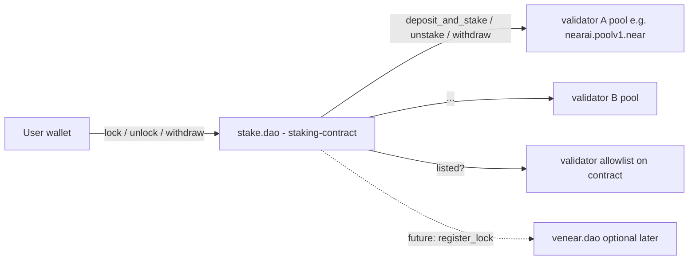

# Staking Contract — Detailed Design

This document is the design reference for `stake.dao` (the `staking-contract` crate). Implementation may evolve; see [README.md](../README.md), [PLAN.md](PLAN.md), and [ACTION_ITEMS.md](ACTION_ITEMS.md) for current scope and status.

---

The following sections specify the on-chain design of the contract in the [staking-contract](../) crate. This doc is written so [README.md](../README.md) can stay aligned with or distill from it.

## 1. Goals and non-goals

Goals:
- Allow a NEAR account (the "staker") to purchase a service provider's product or subscribe to a plan by **locking** NEAR for a chosen duration. Service providers are examples such as NEAR AI or near.com—any offering that runs its **own** validator pool for this purpose. The locked NEAR is staked into that product's validator pool; the validator's commission funds the provider (e.g. 100% commission on a pool such as `nearai.poolv1.near`).
- Be the single on-chain entrypoint for that billing model: products, prices, subscriptions, locks.
- Price catalog amounts are **NEAR (yocto) only**; lock sufficiency is enforced on-chain via [`check_near_price_lock`](../src/internal.rs) (locked NEAR × duration vs catalog line item). There is **no** oracle and **no** USD conversion path.
- Use a pooled meta-validator model: `stake.dao` is the only delegator on each whitelisted validator pool; per-user accounting is internal via shares.
- Be governed by HoS DAO (initially a security multisig), upgradable in the same pattern as the sibling contracts.
- Share patterns/types with the existing workspace ([common/](../../common/), [lockup-contract/](../../lockup-contract/), [venear-contract/](../../venear-contract/)).

Non-goals (for v1):
- Granting veNEAR voting power for `stake.dao` locks (kept independent of `venear-contract`; can be added later via a "register lock with veNEAR" hook).
- Liquid staking tokens (no fungible share token issued; shares are internal).
- Cross-validator rebalancing / autocompounding (stake stays where the user purchased).
- On-chain credit redemption — "credits" are an off-chain billing concept driven by `lock` events.

## 2. System architecture

Key roles:
- **Contract owner** — HoS DAO (initially a multisig). Onboards validators (adds them to the on-contract allowlist), assigns each validator's owner, sets operators/global parameters, upgrades the contract.
- **Guardians** — can pause the contract (same pattern as [venear-contract/src/pause.rs](../../venear-contract/src/pause.rs)).
- **Operator(s)** — drive `epoch_stake`/`epoch_unstake`/`epoch_withdraw`. Restricted by `Config.operators` (empty list ⇒ permissionless).
- **Validator owner** (e.g., `nearai.sputnik-dao.near`) — owner of an on-chain `Validator` entry. Manages that validator's products and prices on stake.dao, and (separately, off this contract) controls the underlying staking pool itself (commission, etc.). The contract owner does **not** manage products/prices.
- **Stakers** — end users buying products/subscriptions.

## 3. Crate layout

See source files under [src/](../src/). Key modules: `config`, `types`, `ids`, `validators`, `products`, `accounts`, `governance`, `pause`, `upgrade`, `lock`, `unlock`, `withdraw`, `epoch`, `pool_callbacks`, `subscriptions`, `events`, `gas`, `internal` (share math and NEAR price lock check).

## 4. Data model (summary)

- **Contract state**: `config`, `paused`, `validators` (allowlist + pool accounting), `validator_ids`, `product_ids`, catalog maps (`products`, `prices`), `accounts`, `subscriptions`, `locks`, `user_validator_shares`, `user_pending_unstake`, `user_lock_count` (locks ever created; drives per-lock storage requirement), `subscription_by_account_product`, `id_nonce`.
- **Config**: owner, guardians, operators, min/max lock duration, epoch unstake settle epochs, min storage deposit, `per_lock_storage_stake`, min lock amount. No oracle or foreign-denomination fields.
- **Validator**: `pool_account_id`, status, `total_shares`, `total_staked_balance`, pending stake/unstake/withdraw, epoch and `tx_status` (Idle/Busy), etc. (see [validators.rs](../src/validators.rs)). Pool operator identity for catalog calls comes from the pool’s `get_owner_id()`, not from this struct.
- **Price**: NEAR amount in yocto, `price_type` (one-off vs recurring), optional `billing_period`, `lock_factor_near_months` for the duration-weighted sufficiency check.
- **IDs**: `prod_*`, `price_*`, `sub_*`, `lock_*` with deterministic base62 suffixes (details in [PLAN.md](PLAN.md)).
- **Unlock**: The lock owner calls `unlock(lock_id)` once `now >= lock.end_ns`; share→NEAR conversion runs at unlock time so rewards that accrued to the user’s share position are reflected in the exit.

## 5. Governance

- **Contract owner**: allowlist (`add_validator`, `pause_validator`, `remove_validator`), operators, guardians, storage/lock parameter setters, upgrade.
- **Validator owner** (via pool-owner-verified catalog callbacks in `products.rs`): `create_product`, `edit_product`, `archive_product`, `delete_product`, `create_price`, `edit_price`, `archive_price`, `delete_price` for their validator only.

## 6. External interfaces

- `ext_staking_pool`: `deposit_and_stake`, `unstake`, `withdraw_all`, balance views — used by epoch jobs and balance refresh.
- Catalog mutations verify the caller against the pool’s `get_owner_id()` using a cross-contract call pattern (`*_after_get_owner` callbacks); there is no separate price oracle contract.

No HoS staking-pool whitelist cross-call — stake.dao allowlist is internal.

## 7. Open items

See [PLAN.md](PLAN.md) for `lock_factor_near_months` / `LOCK_FACTOR_DENOM` semantics, Stripe ID suffix lengths, and subscription duration-equivalent details.
