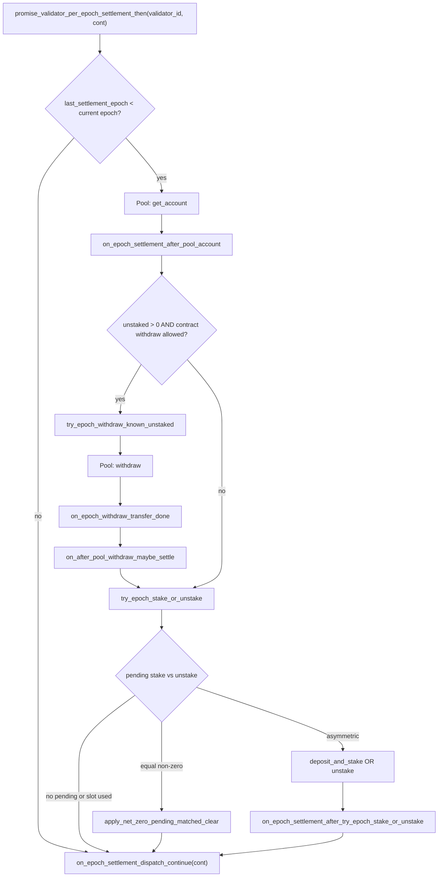

# Epoch settlement chain

Reference for the validator pool pipeline in [`src/epoch.rs`](../src/epoch.rs). This document walks through **every promise hop** in the shared **pre-user settlement** path used by **`lock`**, **`unlock`**, and user **`withdraw`**, plus the related **unlock unstake tail** and public **`epoch_settle`**.

For product-level goals and implementation status, see [`LAZY_EPOCH_PIPELINE.md`](LAZY_EPOCH_PIPELINE.md).

---

## Purpose

Before a user-visible action (mint shares, queue an unlock unstake, or pay out a claim), the contract synchronizes with the **allowlisted staking pool** (`validator_id` = pool contract account):

1. **Refresh** cached pool balance for this contract’s pool account.
2. **Pull** spendable unstaked NEAR from the pool into the on-contract **withdraw bucket** when allowed.
3. **Net-settle** queued stake vs unstake (at most one pool `deposit_and_stake` or `unstake` per NEAR epoch).
4. **Dispatch** the caller’s continuation (`PerEpochContinue`).

Withdraw-from-pool does **not** consume the stake/unstake epoch slot; only successful net stake, net unstake, or net-zero clearance bumps `last_settlement_epoch`.

---

## Validator state used by settlement

| Field | Role in settlement |
|--------|---------------------|
| `total_staked_balance` | Cached **staked + unstaked** on the pool for this contract’s account. Updated on `get_account`, and adjusted on stake/unstake/withdraw callbacks. Used for share mint/burn pricing. |
| `last_balance_refresh_ns` | Timestamp of last successful pool balance sync. |
| `pending_to_stake` | NEAR queued for the next pool `deposit_and_stake` (from locks). |
| `pending_to_unstake` | NEAR queued for the next pool `unstake` (from unlocks). Net-settled against `pending_to_stake`. |
| `pending_to_withdraw` | NEAR already pulled from the pool; users claim via `withdraw`. |
| `pending_user_unstake_total` | Sum of user tranche liability; after net-zero settle, `pending_to_unstake` is re-rooted here. |
| `last_unstake_epoch` | NEAR epoch of last successful pool `unstake` callback. |
| `last_settlement_epoch` | Last epoch that completed pre-user pipeline + net settle (or net-zero). **Mutex** for one stake/unstake per pool per NEAR epoch. |
| `tx_status` | `Idle` vs `Busy` — at most one in-flight mutating pool pipeline per validator row. |

Config: `epoch_unstake_settle_epochs` gates **further pool `unstake`** via `validator_unstake_waiting_finished`. **Withdraw-from-pool** uses the pool’s `can_withdraw` from `get_account` (see below).

---

## Pool view: `get_account`

One cross-contract view replaces separate total/unstaked queries.

**Pool call:** `get_account(staking_contract_id)` → [`PoolAccountView`](../src/types.rs):

| Field | Meaning |
|--------|---------|
| `staked_balance` | Staked NEAR (share-priced). |
| `unstaked_balance` | Liquid on pool, not yet withdrawn to this contract. |
| `can_withdraw` | Pool flag: `unstaked_available_epoch_height <= epoch_height`. |

**Derived:** `total_balance = staked + unstaked` → stored in `Validator::total_staked_balance`.

---

## Entry points

| Entry | When | Settlement used? |
|--------|------|------------------|
| `lock_for_product` / `lock_for_subscription` | User attaches NEAR | `promise_validator_per_epoch_settlement_then` → `CatalogLockMint` |
| `unlock` | Lock owner, after `end_ns` | Same → `UnlockQueueUnstake` |
| `withdraw` | User claims tranches (WASM) | Same → `WithdrawUserTransfer` |
| `epoch_settle(validator_id)` | Anyone; manual retry | Same orchestrator as catalog flows → `SettleOnly` (fast path when already settled this epoch) |

[`Contract::promise_validator_per_epoch_settlement_then`] requires **`Idle`**, then sets **`Busy`** for the whole pipeline. WASM entrypoints (`lock` / `unlock` / `withdraw`) also check **`Idle`** before chaining in.

---

## Decision: full pipeline vs fast path

```
last_settlement_epoch < env::epoch_height()  ?
```

| Branch | Behavior |
|--------|----------|
| **Yes** (settlement due) | Run full pre-user chain below (one `get_account` per user action that hits this path in that epoch). |
| **No** (already settled this epoch) | Skip balance refresh, withdraw-if-ready, and net settle; jump straight to `on_epoch_settlement_dispatch_continue(cont)` using **cached** `total_staked_balance`. |

---

## Main flow (full path)



---

## Step-by-step: promise chain

Numbered steps match `/** [Pipeline N] */` on functions in `src/epoch.rs` (module doc table).

### **[Pipeline 0]** — `promise_validator_per_epoch_settlement_then`

- **File:** `epoch.rs`
- **Called from:** `lock.rs`, `unlock.rs`, `withdraw.rs`, `epoch_settle` (WASM)
- **Args:** `validator_id`, `cont: PerEpochContinue`
- **Entry:** `require!(tx_status == Idle)` → set **`Busy`** (held until [`Contract::release_validator_pool_pipeline`] at a flow tail).
- **Fast path:** if `last_settlement_epoch >= env::epoch_height()` → self-call `on_epoch_settlement_dispatch_continue(cont)` only (row stays **`Busy`** until the tail releases it).

### **[Pipeline 1]** — `on_epoch_settlement_after_pool_account` (after pool `get_account`)

- **Pool:** `get_account(current_account_id())` — gas: `staking_pool::GET_ACCOUNT`
- **On failed promise:** panic — retry later.
- **On success:** require **`Busy`**; refresh `total_staked_balance` / `last_balance_refresh_ns`; then either **2a–2c** (withdraw-if-ready) or **3**.

### **[Pipeline 2a–2c]** — withdraw-if-ready (optional, from **1**)

When `pool_account.unstaked() > 0` and `pool_account.can_withdraw`:

```
try_epoch_withdraw_known_unstaked  [2a]
  → pool withdraw
  → on_epoch_withdraw_transfer_done  [2b]
  → on_after_pool_withdraw_maybe_settle  [2c]
```

**2c** is shared with unlock **5b′**: `cont: None` runs tail **3** only when pending; settlement passes `Some(cont)` and runs **3** → **4** in one step (no separate hop).

### **[Pipeline 3]** (callbacks **3a–3c**, then **3′**) — `try_epoch_stake_or_unstake`

**Called from:** **1** (direct or via **2c** with `Some(cont)`), **2c** / **5a** / **5b′** (`None` — tail-only settle).

**When `Some(cont)` (settlement path):**

| Condition | Action |
|-----------|--------|
| No pending or `last_settlement_epoch >= epoch_height` | → **4** `on_epoch_settlement_dispatch_continue(cont)` |
| `pending_to_stake == pending_to_unstake > 0` | Inline **3a** `apply_net_zero_pending_matched_clear` → **4** |
| Asymmetric pending, slot free | Pool op → **3b** / **3c** → **3′** → **4** |

**When `None` (tail-only):** panics if nothing queued; returns empty promise if epoch slot already used; net-zero inline without dispatch.

**Pool path preconditions:**

- `last_settlement_epoch < epoch_height`
- `tx_status == Busy` (from [`Contract::promise_validator_per_epoch_settlement_then`]; unchanged across pool callbacks)

**Pool branches (yocto):**

| `pending_to_stake` vs `pending_to_unstake` | Pool action | Callback | `last_settlement_epoch` on success |
|--------------------------------------------|-------------|----------|-------------------------------------|
| Equal, > 0 | None (inline **3a**) | `apply_net_zero_pending_matched_clear` (synchronous in **3**) | Current epoch |
| Stake > unstake | `deposit_and_stake(net)` + attached `net` | `on_deposit_and_stake(net, absorb_unstake)` | Current epoch |
| Unstake > stake | `unstake(net)` (requires `validator_unstake_waiting_finished` if `last_unstake_epoch > 0`) | `on_unstake(net, absorb_stake)` | Current epoch; sets `last_unstake_epoch` |

**Net-zero side effect:** `pending_to_stake = 0`; `pending_to_unstake = pending_user_unstake_total` (user exit liability drives next unstake round).

**Absorb semantics:** Matched pending on the smaller side is passed into callbacks and subtracted from both queues on success (stake absorbs unstake pending and vice versa).

### **[Pipeline 4–6]** — dispatch, user tail (**5a–5c**), `on_epoch_pipeline_terminal_release`

| `PerEpochContinue` variant | Next handler | Module |
|----------------------------|--------------|--------|
| `CatalogLockMint { … }` | `on_lock_finally_mint_and_maybe_post_settle` | `lock.rs` → `commit_catalog_lock`; may post `try_epoch_stake_or_unstake` if slot still free |
| `UnlockQueueUnstake { … }` | `on_unlock_tail_after_pre_user_settle` | `unlock.rs` → `commit_share_exit` → `promise_post_unlock_unstaked_pipeline` |
| `WithdrawUserTransfer { … }` | `payout_user_withdraw` (inline from **4**) | `withdraw.rs` |
| `SettleOnly { … }` | No-op promise | Then [`Contract::on_epoch_pipeline_terminal_release`] |

---

## Withdraw-from-pool (detail)

### **[Pipeline 2a]** — `try_epoch_withdraw_known_unstaked`

Uses **already-fetched** `unstaked_balance` (no second pool view).

1. Require `unstaked > 0`, `pool_can_withdraw`, and `tx_status == Busy`.
2. `promise_epoch_withdraw_unstaked` → pool `withdraw(amount)` → `on_epoch_withdraw_transfer_done`.

### **[Pipeline 2b]** — `on_epoch_withdraw_transfer_done`

- Does **not** clear pipeline **`Busy`** (mutex held until flow tail).
- On success: decrement `total_staked_balance`, add to `pending_to_withdraw` (requires `pending_user_unstake_total > 0`).
- Logs `log_validator_withdraw_in`.

---

## Unlock path after shared settlement

Not part of the **same** `PerEpochContinue` chain, but uses the same pool helpers:

```
unlock
  → promise_validator_per_epoch_settlement_then (full or fast path)
  → on_unlock_tail_after_pre_user_settle
       → commit_share_exit, lock → UnlockRequested
       → promise_post_unlock_unstaked_pipeline
            → get_account
            → on_unstake_pipeline_pool_account
                 → [optional] try_epoch_withdraw_known_unstaked
                 → on_after_pool_withdraw_maybe_settle
                 → [optional] try_epoch_stake_or_unstake
                 → (dispatch tail completes → `on_epoch_pipeline_terminal_release`)
```

If the pool **already** settled this epoch during the shared preamble, the unlock tail may still `try_epoch_stake_or_unstake` when the epoch slot is free and pending queues are non-zero.

---

## `PerEpochContinue` payload

Defined in [`src/types.rs`](../src/types.rs). Serialized through promise args — keep fields small; reload catalog rows by id in callbacks.

```rust
pub enum PerEpochContinue {
    CatalogLockMint { validator_id, buyer, locked, duration_ns, order, subscription_followup },
    UnlockQueueUnstake { validator_id, lock_id, account_id, shares_remove },
    WithdrawUserTransfer { validator_id, account_id },
    SettleOnly { validator_id },
}
```

---

## Mutex and concurrency rules

1. **One net stake/unstake per pool per NEAR epoch** — `last_settlement_epoch`.
2. **One orchestrated pipeline at a time** — `tx_status: Busy` from `promise_validator_per_epoch_settlement_then` until `on_epoch_pipeline_terminal_release` after the user-flow tail promise completes.
3. **User actions wait on Busy** — lock/unlock/withdraw require `Idle` at entry.
4. **Withdraw vs unstake epoch slot** — pool `withdraw` does not set `last_settlement_epoch`; only stake/unstake/net-zero do.

---

## Withdraw vs unstake gates

| Gate | Source | Used when |
|------|--------|-----------|
| `pool_account.can_withdraw` | Pool `get_account` | Whether to call `try_epoch_withdraw_known_unstaked` / pool `withdraw` |
| `validator_unstake_waiting_finished` | This contract (`last_unstake_epoch` + `epoch_unstake_settle_epochs`) | Blocking another pool `unstake` in `try_epoch_stake_or_unstake` only |

---

## Callback reference (`#[private]`)

Stable promise target names — change only with coordinated migration.

| Step | Callback | Triggered after |
|------|----------|-----------------|
| **1** | `on_epoch_settlement_after_pool_account` | Pool `get_account` (settlement) |
| **2b** | `on_epoch_withdraw_transfer_done` | Pool `withdraw` |
| **2c** | `on_after_pool_withdraw_maybe_settle` | **2b**; settlement `Some(cont)`, unlock **5b′** `None` |
| **3** | `try_epoch_stake_or_unstake` | **1**, **2c** (`Some` / `None`), **5a** / **5b′** (inline **3a** net-zero when pending queues match) |
| **3b** | `on_deposit_and_stake` | Pool `deposit_and_stake` |
| **3c** | `on_unstake` | Pool `unstake` |
| **3′** | `on_epoch_settlement_after_try_epoch_stake_or_unstake` | Async **3** |
| **4** | `on_epoch_settlement_dispatch_continue` | End of pre-user pipeline |
| **5a** | `on_lock_finally_mint_and_maybe_post_settle` | **4** (lock) |
| **5b** | `on_unlock_tail_after_pre_user_settle` | **4** (unlock) |
| **5b′** | `on_unstake_pipeline_pool_account` | Pool `get_account` (unlock tail) |
| **5c** | `payout_user_withdraw` | **4** (withdraw) |
| **6** | `on_epoch_pipeline_terminal_release` | **4** tail complete → **`Idle`** |

---

## Events (`events::log_epoch_operation`)

| Tag | When |
|-----|------|
| `epoch_withdraw` | Start of `try_epoch_withdraw_known_unstaked` |
| `epoch_settle_net_zero` | Net-zero branch |
| `epoch_settle_stake` | Net stake branch |
| `epoch_settle_unstake` | Net unstake branch |

---

## Public `epoch_settle`

- **Method:** `epoch_settle(validator_id)` → `promise_validator_per_epoch_settlement_then` → `SettleOnly`.
- **Use:** Manual retry when automatic promises did not finish; same pre-user rules as **`lock`** / **`unlock`** / **`withdraw`**.
- **Fast path:** If `last_settlement_epoch >= epoch_height`, skips `get_account` / withdraw / net settle and completes immediately (no-op tail).
- **Requires:** `tx_status == Idle`. Does **not** panic when pending queues are empty on the full path.

---

## Gas budget (static)

See [`src/gas.rs`](../src/gas.rs):

- `staking_pool::GET_ACCOUNT`, `DEPOSIT_AND_STAKE`, `UNSTAKE`, `WITHDRAW`
- `callbacks::ON_EPOCH_SETTLEMENT_AFTER_POOL_ACCOUNT` (merged refresh + withdraw branch)
- `callbacks::ON_EPOCH_SETTLEMENT_DISPATCH`, `ON_EPOCH_SETTLEMENT_AFTER_TRY_EPOCH_STAKE_OR_UNSTAKE`
- Unlock/lock/withdraw tail callbacks (`ON_LOCK_FINALLY_MINT`, `ON_UNLOCK_TAIL_AFTER_PRE_USER`, etc.)

Long chains need sufficient prepaid gas on the **root** user transaction (`lock` / `unlock` / `withdraw`).

---

## Related source files

| File | Responsibility |
|------|----------------|
| [`src/epoch.rs`](../src/epoch.rs) | Orchestration, pool ext trait, settlement callbacks |
| [`src/lock.rs`](../src/lock.rs) | Lock entry, `commit_catalog_lock`, mint tail |
| [`src/unlock.rs`](../src/unlock.rs) | Unlock entry, share exit, post-settlement unstake pipeline |
| [`src/withdraw.rs`](../src/withdraw.rs) | User claim, tranche math, payout |
| [`src/validators.rs`](../src/validators.rs) | `Validator` struct, `validator_unstake_waiting_finished` |
| [`src/types.rs`](../src/types.rs) | `PoolAccountView`, `PerEpochContinue` |

---

## Review checklist

When auditing a change to this pipeline, verify:

- [ ] Fast path does not skip mint/unlock pricing when cache is stale for the **business** requirement (only when `last_settlement_epoch` is current).
- [ ] `total_staked_balance` stays consistent across refresh, withdraw, and stake/unstake callbacks.
- [ ] `pending_to_unstake` / `pending_user_unstake_total` stay aligned after net-zero and unlock.
- [ ] `Busy` is always cleared on success and failure paths.
- [ ] At most one successful stake/unstake per pool per NEAR epoch.
- [ ] Withdraw uses contract + pool gates and does not double-query unstaked balance in the settlement chain.
- [ ] `PerEpochContinue` args remain bounded for callback gas.
