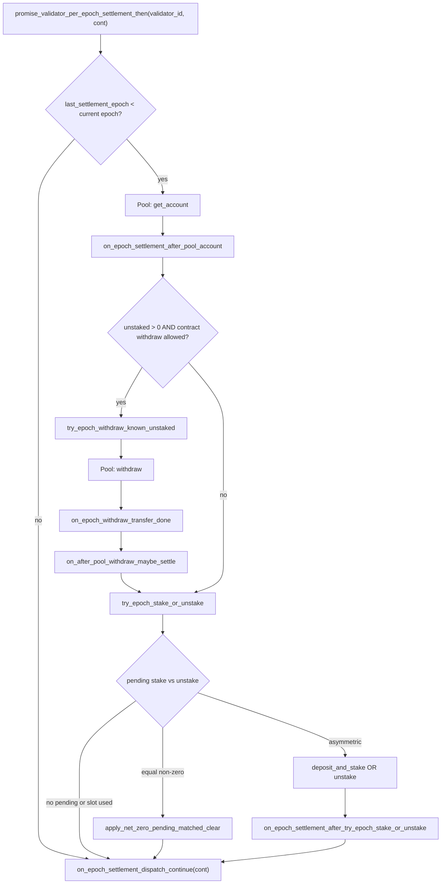

# Lazy epoch pipeline (user-driven pool operations)

Design reference for stake.dao’s validator pool work (`deposit_and_stake`, `unstake`, withdraw-from-pool, balance refresh). There is **no** separate operator role and **no** public `epoch_stake` / `epoch_unstake` / `epoch_withdraw` / `refresh_validator_balance` batch API. Users drive settlement through **`lock`**, **`unlock`**, **`withdraw`**, and optional **`epoch_settle(validator_id)`** for manual retry.

Implementation: [`src/epoch.rs`](../src/epoch.rs). Entrypoints: [`lock.rs`](../src/lock.rs), [`unlock.rs`](../src/unlock.rs), [`withdraw.rs`](../src/withdraw.rs).

---

## Goals and rules

| Topic | Decision |
|--------|-----------|
| Public `epoch_stake` / `epoch_unstake` / `epoch_withdraw` / `refresh_validator_balance` | **Removed** from the contract ABI. |
| `operators` / `set_operators` | **Removed** (no live deployments with old `Config`). |
| Balance before mint / unlock | **`get_account`** when **`last_settlement_epoch` < `epoch_height`** (then withdraw-if-ready and **`try_epoch_stake_or_unstake`** on existing pending). When **`last_settlement_epoch` ≥ `epoch_height`**, **skip** that pre-user pipeline and mint / unlock using cached **`total_staked_balance`**. |
| Withdraw before new unstake | If settle allows and the pool has withdrawable unstaked NEAR, **pull from pool first**, then `unstake`. |
| First delegation to an empty validator | Same **`min_lock_amount`** gate as any lock (never below 1 NEAR — [`PROTOCOL_MIN_LOCK_AMOUNT_YOCTO`](../src/config.rs)). |
| Subscription downgrade prorate | **Does not** schedule pool unstake; user **`unlock`** drives unstake. |
| `withdraw` | May chain pool withdraw when the on-contract bucket is empty but settlement allows. |
| Pool mutating actions per NEAR epoch | Per allowlisted pool (`validator_id` = pool account), at most **one** successful **`deposit_and_stake`** **or** **`unstake`** per `epoch_height` (**`Validator.last_settlement_epoch`**). **`try_epoch_stake_or_unstake`** nets **`pending_to_stake`** vs **`pending_to_unstake`**: stake excess, unstake excess, or clear both without a pool call when equal (still bumps **`last_settlement_epoch`**). Withdraw-from-pool does **not** consume that slot. |

**Pre-ship concerns:** prepaid gas on long promise chains (see [`API.md`](API.md) and [`gas.rs`](../src/gas.rs)); small `UserAction` callback payloads; **`tx_status == Busy`** retries; sandbox/deploy scripts must use user flows, not removed `epoch_*` batch methods.

---

## Purpose (settlement preamble)

Before a user-visible action (mint shares, queue unlock unstake, or pay out a claim), the contract synchronizes with the **allowlisted staking pool**:

1. **Refresh** cached pool balance for this contract’s pool account.
2. **Pull** spendable unstaked NEAR into **`pending_to_withdraw`** when allowed.
3. **Net-settle** queued stake vs unstake (at most one pool `deposit_and_stake` or `unstake` per NEAR epoch).
4. **Dispatch** the caller’s continuation (`UserAction`).

Withdraw-from-pool does **not** consume the stake/unstake epoch slot; only successful net stake, net unstake, or net-zero clearance bumps **`last_settlement_epoch`**.

---

## Validator state

| Field | Role |
|--------|------|
| `total_staked_balance` | Cached staked + unstaked on the pool for this contract. Updated on `get_account` and stake/unstake/withdraw callbacks. Used for share mint/burn pricing. |
| `last_balance_refresh_ns` | Timestamp of last successful pool balance sync. |
| `pending_to_stake` | NEAR queued for next pool `deposit_and_stake` (from locks). |
| `pending_to_unstake` | NEAR queued for next pool `unstake` (from unlocks). Net-settled against `pending_to_stake`. |
| `pending_to_withdraw` | NEAR pulled from the pool; users claim via `withdraw`. |
| `pending_user_unstake_total` | Sum of user tranche liability; after net-zero settle, `pending_to_unstake` is re-rooted here. |
| `last_unstake_epoch` | NEAR epoch of last successful pool `unstake` callback. |
| `last_settlement_epoch` | Last epoch that completed pre-user pipeline + net settle (or net-zero). **Mutex** for one stake/unstake per pool per NEAR epoch. |
| `tx_status` | `Idle` vs `Busy` — at most one in-flight mutating pool pipeline per validator row. |

Config **`epoch_unstake_settle_epochs`** gates further pool **`unstake`** via `validator_unstake_waiting_finished`. **Withdraw-from-pool** uses the pool’s **`can_withdraw`** from **`get_account`**.

---

## Pool view: `get_account`

One cross-contract view replaces separate total/unstaked queries.

**Pool call:** `get_account(staking_contract_id)` → [`PoolAccountView`](../src/types.rs):

| Field | Meaning |
|--------|---------|
| `staked_balance` | Staked NEAR (share-priced). |
| `unstaked_balance` | Liquid on pool, not yet withdrawn to this contract. |
| `can_withdraw` | `unstaked_available_epoch_height <= epoch_height`. |

**Derived:** `total_balance = staked + unstaked` → `Validator::total_staked_balance`.

---

## Entry points

| Entry | When | `UserAction` tail |
|--------|------|-------------------------|
| `lock` | User attaches NEAR | `CommitLock` |
| `unlock` | Lock owner, after `end_ns` | `UnlockQueueUnstake` |
| `withdraw` | User claims tranches (WASM) | `WithdrawUserTransfer` |
| `epoch_settle(validator_id)` | Anyone; manual retry | `SettleOnly` |

[`promise_validator_per_epoch_settlement_then`] requires **`Idle`**, sets **`Busy`** until [`on_epoch_pipeline_terminal_release`]. User entrypoints also require **`Idle`** before chaining.

---

## Full pipeline vs fast path

```
last_settlement_epoch < env::epoch_height()  ?
```

| Branch | Behavior |
|--------|----------|
| **Yes** (settlement due) | Full pre-user chain (one `get_account` per user action that hits this path in that epoch). |
| **No** (already settled this epoch) | Skip refresh, withdraw-if-ready, and net settle; jump to `on_epoch_settlement_dispatch_continue(cont)` using **cached** `total_staked_balance`. |

---

## Main flow (full path)



Numbered steps match `/** [Pipeline N] */` in [`epoch.rs`](../src/epoch.rs).

### **[Pipeline 0]** — `promise_validator_per_epoch_settlement_then`

- **Called from:** `lock.rs`, `unlock.rs`, `withdraw.rs`, `epoch_settle`
- **Args:** `validator_id`, `cont: UserAction`
- `require!(tx_status == Idle)` → set **`Busy`**
- **Fast path:** if `last_settlement_epoch >= epoch_height()` → `on_epoch_settlement_dispatch_continue(cont)` only

### **[Pipeline 1]** — `on_epoch_settlement_after_pool_account`

- After pool **`get_account`**
- On success: refresh `total_staked_balance` / `last_balance_refresh_ns`; then **2a–2c** or **3**

### **[Pipeline 2a–2c]** — withdraw-if-ready (optional)

When `unstaked > 0` and `can_withdraw`:

```
try_epoch_withdraw_known_unstaked  [2a]
  → pool withdraw
  → on_epoch_withdraw_transfer_done  [2b]
  → on_after_pool_withdraw_maybe_settle  [2c]
```

**2c** with `Some(cont)` runs **3** → **4**; with `None` (unlock tail) runs tail **3** only.

### **[Pipeline 3]** — `try_epoch_stake_or_unstake` (callbacks **3a–3c**, **3′**)

| Condition | Action |
|-----------|--------|
| No pending or `last_settlement_epoch >= epoch_height` | → **4** |
| `pending_to_stake == pending_to_unstake > 0` | Inline **3a** net-zero → **4** |
| Asymmetric pending, slot free | Pool op → **3b** / **3c** → **3′** → **4** |

| Pending comparison | Pool action | On success |
|--------------------|-------------|------------|
| Equal, > 0 | None (inline **3a**) | `last_settlement_epoch` = current epoch |
| Stake > unstake | `deposit_and_stake(net)` | Current epoch |
| Unstake > stake | `unstake(net)` (may need `validator_unstake_waiting_finished`) | Current epoch; `last_unstake_epoch` |

**Net-zero:** `pending_to_stake = 0`; `pending_to_unstake = pending_user_unstake_total`.

### **[Pipeline 4–6]** — dispatch and release

| `UserAction` | Handler | Module |
|--------------------|---------|--------|
| `CommitLock` | `on_lock_finally_mint_and_maybe_post_settle` | `lock.rs` |
| `UnlockQueueUnstake` | `on_unlock_tail_after_pre_user_settle` | `unlock.rs` |
| `WithdrawUserTransfer` | `payout_user_withdraw` | `withdraw.rs` |
| `SettleOnly` | No-op → `on_epoch_pipeline_terminal_release` | `epoch.rs` |

---

## Unlock path after shared settlement

```
unlock
  → promise_validator_per_epoch_settlement_then (full or fast)
  → on_unlock_tail_after_pre_user_settle
       → commit_share_exit, lock → UnlockRequested
       → promise_post_unlock_unstaked_pipeline
            → get_account
            → on_unstake_pipeline_pool_account
                 → [optional] try_epoch_withdraw_known_unstaked
                 → on_after_pool_withdraw_maybe_settle
                 → [optional] try_epoch_stake_or_unstake
                 → on_epoch_pipeline_terminal_release
```

If the pool **already** settled this epoch in the preamble, the unlock tail may still run **`try_epoch_stake_or_unstake`** when the epoch slot is free and pending queues are non-zero.

---

## `UserAction`

Defined in [`types.rs`](../src/types.rs). Keep fields small; reload catalog rows by id in callbacks.

```rust
pub enum UserAction {
    CommitLock { validator_id, buyer, locked, duration_ns, order, subscription_followup },
    UnlockQueueUnstake { validator_id, lock_id, account_id, shares_remove },
    WithdrawUserTransfer { validator_id, account_id },
    SettleOnly { validator_id },
}
```

---

## Mutex and concurrency

1. **One net stake/unstake per pool per NEAR epoch** — `last_settlement_epoch`.
2. **One orchestrated pipeline at a time** — `Busy` from **[0]** until **`on_epoch_pipeline_terminal_release`**.
3. **User actions wait on Busy** — lock / unlock / withdraw require `Idle` at entry.
4. **Withdraw vs unstake slot** — pool `withdraw` does not set `last_settlement_epoch`.

| Gate | Source | Used when |
|------|--------|-----------|
| `pool_account.can_withdraw` | Pool `get_account` | `try_epoch_withdraw_known_unstaked` |
| `validator_unstake_waiting_finished` | `last_unstake_epoch` + `epoch_unstake_settle_epochs` | Blocking another pool `unstake` in **3** |

---

## Callback reference (`#[private]`)

| Step | Callback | After |
|------|----------|-------|
| **1** | `on_epoch_settlement_after_pool_account` | Pool `get_account` |
| **2b** | `on_epoch_withdraw_transfer_done` | Pool `withdraw` |
| **2c** | `on_after_pool_withdraw_maybe_settle` | **2b** |
| **3** | `try_epoch_stake_or_unstake` | **1**, **2c** |
| **3b** | `on_deposit_and_stake` | Pool `deposit_and_stake` |
| **3c** | `on_unstake` | Pool `unstake` |
| **3′** | `on_epoch_settlement_after_try_epoch_stake_or_unstake` | Async **3** |
| **4** | `on_epoch_settlement_dispatch_continue` | End of pre-user pipeline |
| **5a** | `on_lock_finally_mint_and_maybe_post_settle` | **4** (lock) |
| **5b** | `on_unlock_tail_after_pre_user_settle` | **4** (unlock) |
| **5b′** | `on_unstake_pipeline_pool_account` | Pool `get_account` (unlock tail) |
| **5c** | `payout_user_withdraw` | **4** (withdraw) |
| **6** | `on_epoch_pipeline_terminal_release` | Tail complete → **`Idle`** |

**Events:** `epoch_withdraw`, `epoch_settle_net_zero`, `epoch_settle_stake`, `epoch_settle_unstake` via `events::log_epoch_operation`.

---

## Public `epoch_settle`

- **`epoch_settle(validator_id)`** → same orchestrator as lock / unlock / withdraw → `SettleOnly`.
- Manual retry when automatic promises did not finish.
- **Fast path:** if already settled this epoch, no-op tail (skips `get_account` / withdraw / net settle).
- Requires **`tx_status == Idle`**.

---

## Gas

See [`gas.rs`](../src/gas.rs): `GET_ACCOUNT`, `DEPOSIT_AND_STAKE`, `UNSTAKE`, `WITHDRAW`, and settlement callback budgets. Root transactions (`lock` / `unlock` / `withdraw`) need sufficient prepaid gas.

---

## Implementation status

| Area | Status |
|------|--------|
| Lazy pipeline (no operators, no public batch `epoch_*`) | **Done** |
| `epoch_settle` manual retry | **Done** |
| `withdraw` pool prefetch when bucket empty | **Done** |
| Docs / API / README | **Done** |
| Sandbox + unit tests | **Done** (CI on Ubuntu; host needs near-workspaces-supported arch) |

---

## Unit tests vs WASM

Host `tests/*.rs` use synchronous lock mint (`not(target_arch = "wasm32")`) because `testing_env!` does not run promise chains. Production WASM uses the full async pipeline. Sandbox tests deploy built WASM — see [`tests/README.md`](../tests/README.md).

---

## Review checklist

- [ ] Fast path only when `last_settlement_epoch` is current (not when cache is stale for business rules).
- [ ] `total_staked_balance` consistent across refresh, withdraw, stake/unstake callbacks.
- [ ] `pending_to_unstake` / `pending_user_unstake_total` aligned after net-zero and unlock.
- [ ] **`Busy`** cleared on all success and failure paths.
- [ ] At most one successful stake/unstake per pool per NEAR epoch.
- [ ] `UserAction` args bounded for callback gas.
