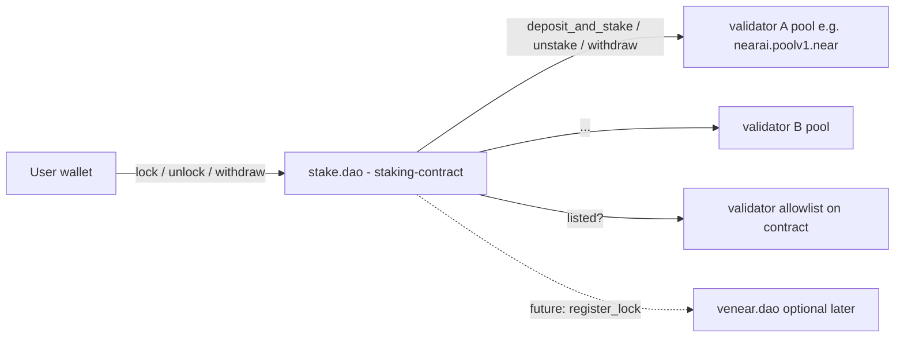
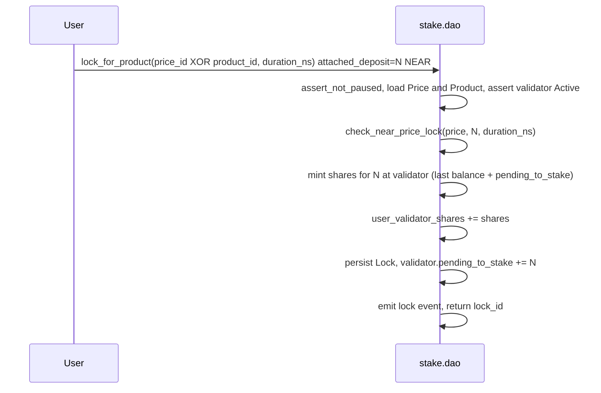

# Staking Contract — Detailed Design

The plan below describes the on-chain design of the contract at [house-of-stake-contracts/staking-contract/](house-of-stake-contracts/staking-contract/). It is a living document: **NEAR-only** pricing is implemented; older references to USD/oracle/hybrid pricing are **obsolete** and kept only where they help explain removed scope.

## 0. Lazy pipeline (current)

**Implemented:** Validator pool mutations are **not** exposed as public `epoch_*` batch jobs and there is **no** `Config.operators` / `set_operators`. Settlement runs from **`lock`**, **`unlock`**, **`withdraw`**, and optional **`epoch_settle(validator_id)`** (manual retry / advance). Per-NEAR-epoch limits use **`Validator.last_settlement_epoch`** and **`try_epoch_stake_or_unstake`**. Full rules and status table: [`LAZY_EPOCH_PIPELINE.md`](LAZY_EPOCH_PIPELINE.md).

**Reading this file:** YAML todos at the top may still show `pending` for already-built modules; treat the todo list as historical scaffolding. Narrative sections below §5 have been updated for the lazy pipeline where noted; [`DESIGN.md`](DESIGN.md) and [`API.md`](API.md) match the ABI.

## 1. Goals and non-goals

Goals:
- Allow a NEAR account (the "staker") to purchase a NEAR AI product or subscribe to a plan by **locking** NEAR for a chosen duration. The locked NEAR is staked into the product's validator pool; the validator's commission funds the product (typically 100% commission on `nearai.poolv1.near`).
- Be the single on-chain entrypoint for NEAR AI billing: products, prices, subscriptions, locks.
- Use a pooled meta-validator model: `stake.dao` is the only delegator on each whitelisted validator pool; per-user accounting is internal via shares.
- Be governed by HoS DAO (initially a security multisig), upgradable in the same pattern as the sibling contracts.
- Share patterns/types with the existing workspace ([house-of-stake-contracts/common/](house-of-stake-contracts/common/), [lockup-contract/](house-of-stake-contracts/lockup-contract/), [venear-contract/](house-of-stake-contracts/venear-contract/)).

Non-goals (for v1):
- Granting veNEAR voting power for `stake.dao` locks (kept independent of `venear-contract`; can be added later via a "register lock with veNEAR" hook).
- Liquid staking tokens (no fungible share token issued; shares are internal).
- Cross-validator rebalancing / autocompounding (stake stays where the user purchased).
- On-chain credit redemption — "credits" are an off-chain billing concept driven by `lock` events.

## 2. System architecture



Key roles:
- **Contract owner** — HoS DAO (initially a multisig). Onboards validators (allowlist), sets guardians and global parameters, upgrades the contract.
- **Guardians** — can pause the contract (same pattern as [venear-contract/src/pause.rs](house-of-stake-contracts/venear-contract/src/pause.rs)).
- **Validator owner** (e.g., `nearai.sputnik-dao.near`) — manages that validator's products and prices on stake.dao (pool `get_owner_id`–attested), and (separately) controls the underlying staking pool. The contract owner does **not** manage products/prices.
- **Stakers** — end users; **`lock` / `unlock` / `withdraw`** schedule pool work when needed ([`LAZY_EPOCH_PIPELINE.md`](LAZY_EPOCH_PIPELINE.md)).

## 3. Crate layout

Add a new crate inside the workspace mirroring sibling crates. Suggested files (all under [house-of-stake-contracts/staking-contract/src/](house-of-stake-contracts/staking-contract/src/)):

- `lib.rs` — `Contract` state, `#[init]`, ext interfaces (`ext_staking_pool`, `ext_self` for callbacks).
- `config.rs` — `Config` (owner, guardians, lock bounds, storage and min lock amounts), `get_config`, propose/accept ownership via governance.
- `governance.rs` — contract-owner setters (`set_*`, `propose_new_owner_account_id`, `accept_ownership`), `assert_owner`, `assert_guardian`, `assert_validator_owner(validator_id)`.
- `pause.rs` — `pause`/`unpause`/`is_paused` (port [venear-contract/src/pause.rs](house-of-stake-contracts/venear-contract/src/pause.rs)).
- `upgrade.rs` — `upgrade()` extern + `migrate_state` (port [venear-contract/src/upgrade.rs](house-of-stake-contracts/venear-contract/src/upgrade.rs)).
- `validators.rs` — `Validator` model and the on-contract validator allowlist (the `validators` map itself); `add_validator`/`pause_validator`/`remove_validator`/`get_validators`; share-pool math per validator. Validator **ownership for catalog operations** is always the staking pool’s `get_owner_id()` (see `products.rs`), not a field on `Validator`.
- `products.rs` — `Product`, `Price`, lifecycle (`create_product`, `edit_product`, `archive_product`, `delete_product`, plus parallel `*_price` methods). All gated by `assert_validator_owner` for the product's validator.
- `subscriptions.rs` — `Subscription` lifecycle RPCs, Phase B prorate at renewal, calendar-month extension helper (`add_months_stripe_style`).
- `utils.rs` — share pool math, `check_near_price_lock` (NEAR-only duration-weighted sufficiency vs catalog line item).
- `accounts.rs` — `Account` (prepaid storage only), NEP-145-style `storage_deposit` / `storage_withdraw`.
- `ids.rs` — Stripe-style identifier wrappers (`ProductId`, `PriceId`, `SubscriptionId`, `LockId`) plus deterministic on-chain ID generator.
- `lock.rs` — `lock_for_product`, `lock_for_subscription`, `check_near_price_lock`, finalize lock and `pending_to_stake` accounting.
- `unlock.rs` — `unlock(lock_id)`, user-initiated only.
- `withdraw.rs` — user **`withdraw(validator_id)`** (tranche claims + transfer; may chain pool withdraw per lazy pipeline).
- `epoch.rs` — `try_epoch_stake_or_unstake`, `try_epoch_withdraw`, promise chains and self-callbacks for pool operations; public **`epoch_settle(validator_id)`** for manual retry. No separate `pool_callbacks.rs` module in-tree.
- `events.rs` — `EVENT_JSON` emitters for product/price/subscription/lock/unlock/withdraw (extends pattern from [common/src/events.rs](house-of-stake-contracts/common/src/events.rs)).
- `gas.rs` — gas constants per external call (mirrors [lockup-contract/src/gas.rs](house-of-stake-contracts/lockup-contract/src/gas.rs)).
- `types.rs` — `PriceType`, `BillingPeriod`, `OrderRef`, `LockStatus`, `CatalogStatus`, `SubscriptionStatus`, `ValidatorStatus`, `TransactionStatus`, `Product`, `Price`, `Lock`, etc.

`Cargo.toml` mirrors the [voting-contract/Cargo.toml](house-of-stake-contracts/voting-contract/Cargo.toml) reproducible-build header; depends on `common`, `near-sdk`, `serde_json`. The crate is added to the workspace `members` and to `build_all.sh` / `test_all.sh`.

## 4. Data model

### 4.1 Top-level state

The live layout uses `near_sdk::store::{LookupMap, Vector}` and matches [staking-contract/src/lib.rs](../src/lib.rs): `validators`, `validator_ids`, `product_ids`, `products`, `prices`, `accounts`, `subscriptions`, `locks`, `user_validator_shares`, `user_pending_unstake`, `user_lock_count`, `subscription_by_account_product`, `id_nonce`. See the crate for exact types.

### 4.2 Config

```rust
pub struct Config {
    pub owner_account_id: AccountId,
    pub proposed_new_owner_account_id: Option<AccountId>,
    pub guardians: Vec<AccountId>,
    pub min_lock_duration_ns: U64,
    pub max_lock_duration_ns: U64,
    pub epoch_unstake_settle_epochs: u64,
    pub min_storage_deposit: NearToken,
    pub per_lock_storage_stake: NearToken,
    pub min_lock_amount: NearToken,
}
```

There is no oracle account or max-age field; pricing is NEAR-only on lock.

The validator allowlist is the contract-internal `validators: UnorderedMap<AccountId, Validator>` map. It is unrelated to the HoS staking pool whitelist used by [lockup-contract](house-of-stake-contracts/lockup-contract/) — that whitelist controls which pools any user can stake their lockup to, while stake.dao's allowlist controls which validator pools can list NEAR AI products.

### 4.3 Validator (the meta-validator's accounting per pool)

`stake.dao` is a single delegator on each pool. To split rewards/principal fairly across users, each user holds `shares` for that validator; `total_staked_balance / total_shares` converts shares↔NEAR. Locks reserve a portion of those shares from being unstaked early.

```rust
pub struct Validator {
    pub validator_id: AccountId,
    pub status: ValidatorStatus,             // Active | Paused | Removed

    pub total_shares: U128,                  // contract-level total shares for this validator
    pub total_staked_balance: NearToken,     // last known principal+rewards held in the pool
    pub last_balance_refresh_ns: U64,

    pub pending_to_stake: NearToken,
    pub pending_to_unstake: NearToken,
    pub last_unstake_epoch: u64,
    pub last_settlement_epoch: u64,
    pub pending_to_withdraw: NearToken,

    pub tx_status: TransactionStatus,        // Idle | Busy
}
```

Share math (per-validator):
- `shares_for(amount) = amount * total_shares / total_staked_balance` (or 1:1 when pool is empty).
- `near_for(shares) = shares * total_staked_balance / total_shares`.
- `total_staked_balance` for share math includes `pending_to_stake` so existing rewards aren't diluted toward new joiners between `lock` and the next successful pool `deposit_and_stake` from `try_epoch_stake_or_unstake` (user-driven).
- `total_staked_balance` is updated on every confirmed pool deposit/withdraw/refresh callback so existing shares revalue with rewards (and slashes).

`Validator.total_shares` is the canonical contract-level total for that validator and the **denominator** for every share-math computation. It is maintained as an invariant against the per-account view:

```text
sum over accounts a of  a.shares_by_validator[v]  ==  validators[v].total_shares
```

A view method `get_validator(validator_id) -> Validator` (and a paginated `get_validators`) exposes it for off-chain consumers and for unit tests that assert the invariant after each mutation.

### 4.4 Product / Price / Subscription

Catalog amounts are **yoctoNEAR** (`Price.amount`). There is no `Currency` enum in the implementation.

```rust
pub enum PriceType { OneOff, Recurring }
pub enum BillingPeriod { Monthly /* Yearly later */ }

// Stripe-style identifier wrappers (see §4.6 for format and generation).
// Examples: "prod_U0oGl1t1RHksee", "price_1T2meCP9GakuUz2YCwLJL3qG",
//           "sub_3Nq7s2P9Gak0Uz2Y", "lock_4Mp1z9P9GakuUz2Y".
#[derive(Clone, Hash, PartialEq, Eq)]
#[near(serializers=[borsh, json])]
pub struct ProductId(pub String);
pub struct PriceId(pub String);
pub struct SubscriptionId(pub String);
pub struct LockId(pub String);

pub struct Product {
    pub product_id: ProductId,
    pub validator_id: AccountId,
    pub name: String,
    pub description: String,
    pub status: CatalogStatus, // Active | Archived
    pub created_ns: U64,
    pub price_ids: Vec<PriceId>,
    pub default_price_id: Option<PriceId>, // active price only; cleared on archive/delete paths
    pub usage_count: u64,
}

pub struct Price {
    pub price_id: PriceId,
    pub product_id: ProductId,
    pub name: String,
    pub description: String,
    pub amount: U128,                        // yoctoNEAR
    pub price_type: PriceType,
    pub billing_period: Option<BillingPeriod>,
    pub lock_factor_near_months: U128,       // see utils::LOCK_FACTOR_DENOM
    pub status: CatalogStatus,
    pub usage_count: u64,
}

pub struct Subscription {
    pub subscription_id: SubscriptionId,
    pub account_id: AccountId,
    pub product_id: ProductId,
    pub price_id: PriceId,
    pub start_ns: U64,
    pub end_ns: U64,
    pub anchor_day: u8,           // calendar-day anchor (1..=31), used for monthly extension
    pub last_lock_id: LockId,
    pub status: SubscriptionStatus, // Active | Cancelled | Expired
}
```

NEAR pricing rule (implemented in [`utils::check_near_price_lock`](../src/utils.rs)):
- Compute required NEAR-months from the catalog line: `required_nm = amount * lock_factor_near_months / LOCK_FACTOR_DENOM` (yocto-scale integers).
- Require `locked_yocto * duration_ns >= required_nm * AVG_MONTH_NS` so the user’s attached lock and chosen duration jointly satisfy the price.
- Product locks pass explicit `lock_duration_ns`; subscription locks derive duration from the active billing window (`end_ns - now`).

### 4.5 Account & Lock

Per-user share totals live in `Contract.user_validator_shares` (not nested on `Account`). The account record is minimal:

```rust
pub struct Account {
    pub storage_deposit: NearToken,
}
```

```rust
pub struct Lock {
    pub lock_id: LockId,
    pub account_id: AccountId,
    pub validator_id: AccountId,
    pub amount_near: NearToken,
    pub shares: U128,
    pub start_ns: U64,
    pub end_ns: U64,
    pub order: OrderRef,
    pub status: LockStatus,
}
```

`shares` are minted **at lock time** and recorded on the lock; aggregate user position per validator is in `user_validator_shares`. The lock "reserves" that many shares from being unstaked before `end_ns`. Multiple concurrent locks on the same validator simply add to the user's share total; the contract enforces "free shares (not held by any unexpired lock) are the only ones that can be unlocked early" by tracking the sum of `lock.shares` per user-per-validator with `lock.status == Active`.

### 4.6 Stripe-style identifier format

All catalog and lifecycle identifiers follow Stripe's prefixed-base62 layout so they can be reused 1:1 in the off-chain billing system without translation:

- `Product`     → `prod_<base62>` (e.g. `prod_U0oGl1t1RHksee`)
- `Price`       → `price_<base62>` (e.g. `price_1T2meCP9GakuUz2YCwLJL3qG`)
- `Subscription`→ `sub_<base62>`
- `Lock`        → `lock_<base62>`

Generation (deterministic, on-chain, no RNG dependency):

```text
nonce := contract.id_nonce; contract.id_nonce += 1
seed  := sha256( prefix || u64_be(nonce) || u64_be(env::block_height())
              || u64_be(env::block_timestamp()) || env::predecessor_account_id().as_bytes() )
suffix := base62_encode(seed)[0..N]   // N = 14 for prod, 24 for price (matches Stripe), 17 for sub/lock
id     := prefix || "_" || suffix
```

Notes:
- `id_nonce` (in §4.1) guarantees uniqueness even within the same block.
- The hash inputs include `predecessor_account_id` so that two parallel `lock` transactions in the same block by different users do not collide on the same hash.
- Charset is the canonical base62 (`0-9A-Za-z`) for visual parity with Stripe's IDs.
- Suffix length is configurable per type but fixed once the contract launches to avoid downstream parsers breaking.

## 5. Lifecycle flows

### 5.1 Locking for a one-off product purchase (`lock_for_product`)



Notes:
- Production `lock_for_product` / `lock_for_subscription` return `PromiseOrValue<LockId>`: after optional pre-user balance sync and `try_epoch_stake_or_unstake`, the contract mints shares and records `pending_to_stake`; actual `deposit_and_stake` follows the per-epoch rules in [`LAZY_EPOCH_PIPELINE.md`](LAZY_EPOCH_PIPELINE.md) (not a separate public `epoch_stake` call).
- Catalog mutations (`create_product`, `create_price`, …) use a pool `get_owner_id` callback to verify the validator owner; that is unrelated to pricing—locks are priced purely in NEAR on-chain as above.

### 5.2 Locking for a subscription (`lock_for_subscription`)

- Caller passes `price_id` with `Price.price_type == Recurring` (monthly billing period in the implementation).
- Contract creates a new `Subscription` (or extends an existing active one for the same price), pinning `Subscription.anchor_day = day_of_month(start_ns)` on creation, then extends and creates a corresponding `Lock`.
- Calendar-month extension (Stripe-compatible):

  ```text
  let base = max(now, subscription.end_ns)
  let (y, m, _d) = utc_year_month_day(base)
  let target_year_month = (y, m + months)            // overflow into year as needed
  let day = min(subscription.anchor_day, last_day_of_month(target_year_month))
  let new_end_ns = utc_to_ns(target_year_month, day, time_of_day(base))
  ```

  - The day-of-month is preserved across extensions (Jan 15 → Feb 15 → Mar 15 …).
  - When the target month has fewer days than `anchor_day` (e.g., Jan 31 + 1 month), the date snaps to the last day of that month (Feb 28/29). The original `anchor_day` is never overwritten by this clamping, so the next extension can return to the anchor (Feb 28 + 1 month = Mar 31 if the anchor is 31).
- The actual lock duration of this top-up is `new_end_ns - sub.end_ns_before` (not `months * 30 days`), and the price-formula check uses **this** as `duration_months_equivalent = (new_end_ns - sub.end_ns_before) / avg_month_ns` with `avg_month_ns = 30.4375 * 86_400 * 1e9` (Stripe's average month length) so users are charged consistently regardless of which months are crossed.
- Subscription's `end_ns` is moved forward to `new_end_ns` per top-up lock; cancellation is implicit (just don't top up).
- Same share-minting and `pending_to_stake` accounting as one-off purchases.

### 5.3 Unlocking (`unlock`)

Unlock is always user-driven: only `lock.account_id` may call it; there is no separate protocol role that queues unlocks on behalf of users.

- `unlock(lock_id)` is callable once `now >= lock.end_ns`.
- When `last_settlement_epoch` is behind the current NEAR `epoch_height`, the contract runs the shared pre-user pipeline (`get_account_total_balance`, withdraw-if-ready, `try_epoch_stake_or_unstake`) before queueing unstake; otherwise it uses cached `total_staked_balance` for pricing (see [`LAZY_EPOCH_PIPELINE.md`](LAZY_EPOCH_PIPELINE.md)).
- It converts burned shares to NEAR liability, increments `validator.pending_to_unstake` and user tranche bookkeeping (`user_pending_unstake`), sets `Busy`, and continues withdraw-first / `unstake` via promise chains in `epoch.rs`.

**Rationale:** Conversion at **unlock** time keeps room for **per-validator reward sharing** without protocol changes: rewards over the lock period accrue to the user’s shares, and pricing the exit at unlock reflects those rewards (and slashing) correctly.

After unlock, the user receives liquid NEAR via **`withdraw(validator_id)`** (and internal pool withdraw steps), not via removed public `epoch_unstake` / `epoch_withdraw` entrypoints. Unstake spacing still uses `epoch_unstake_settle_epochs` between pool `unstake` rounds.

### 5.4 Claims and withdraw

- **`withdraw(validator_id)`** — user receives cleared NEAR for their unlock tranches on that pool once `epoch_height >=` each tranche’s `available_epoch_height`, capped by `pending_to_withdraw`; may chain internal pool withdraw when the bucket is empty ([`LAZY_EPOCH_PIPELINE.md`](LAZY_EPOCH_PIPELINE.md) §2b), then **transfers** the credited amount to the caller.

### 5.5 Pool settlement (lazy, `epoch.rs`)

There is **no** public `epoch_stake` / `epoch_unstake` / `epoch_withdraw` / `refresh_validator_balance`. Pool calls are composed from **`lock`**, **`unlock`**, **`withdraw`**, and optional **`epoch_settle(validator_id)`** for manual retry. `try_epoch_stake_or_unstake` nets `pending_to_stake` vs `pending_to_unstake` under `last_settlement_epoch` / `epoch_height` rules; withdraw-from-pool is sequenced before new `unstake` when applicable. See [`LAZY_EPOCH_PIPELINE.md`](LAZY_EPOCH_PIPELINE.md) and [`epoch.rs`](../src/epoch.rs).

## 6. Owner / governance methods

Two distinct roles. The contract owner administers the protocol; each validator owner administers only their own validator's products and prices. All methods follow the 1-yocto pattern from [venear-contract/src/governance.rs](house-of-stake-contracts/venear-contract/src/governance.rs).

### 6.1 Contract-owner methods (`assert_owner`)

- `propose_new_owner_account_id`, `accept_ownership`.
- `set_guardians`.
- `set_lock_bounds`, `set_min_lock_amount`, `set_min_storage_deposit`, `set_per_lock_storage_stake`, `set_epoch_unstake_settle_epochs` (see [governance.rs](../src/governance.rs)).

Validator allowlist (contract owner only):
- `add_validator(validator_id)` — synchronous; inserts into the on-contract `validators` map with `total_shares = 0`, `status = Active` (the on-contract `validators` map is itself the allowlist; see §4.2). Pool ownership for catalog changes is always verified via on-chain `get_owner_id` (§6).
- Rotating who may edit the catalog for a pool (e.g. after a SputnikDAO migration) is done by changing the **staking pool contract’s** owner / access control so `get_owner_id()` returns the new admin — there is no `set_validator_owner` on `stake.dao` because it does not cache pool owners on-chain.
- `pause_validator(validator_id)` — flips `status = Paused`; no new locks; existing locks unchanged.
- `remove_validator(validator_id)` — flips `status = Removed`; permitted only when `total_shares == 0 && pending_to_stake == 0 && pending_to_unstake == 0 && pending_to_withdraw == 0`. (Resolves the README "TODO: handle the validators removed from whitelist".)

### 6.2 Validator-owner methods (`assert_validator_owner(validator_id)`)

These are the **only** callers allowed to manage the catalog for their validator. The contract owner cannot call them.

Catalog:
- `create_product(validator_id, name, description) -> ProductId`
- `edit_product(product_id, name, description)` — only `name`, `description` are mutable.
- `archive_product(product_id)`
- `delete_product(product_id)` — requires `usage_count == 0`.
- `create_price(...)` — NEAR amount in yocto, `price_type`, optional `billing_period`, `lock_factor_near_months` (see implementation / tests for exact arity via pool-owner callbacks).
- `edit_price(price_id, name, description)` — only `name`, `description` are mutable.
- `archive_price(price_id)`
- `delete_price(price_id)` — requires `usage_count == 0`.

Once a Price has been used (any Lock references it), it is immutable except for archival/edit-of-display-fields, ensuring stable accounting. Validator-owner catalog actions compare `predecessor_account_id` to the pool’s on-chain `get_owner_id()` (see `products.rs`), not a cached owner field on [`Validator`].

## 7. External interfaces

```rust
#[ext_contract(ext_staking_pool)]
pub trait ExtStakingPool {
    fn deposit_and_stake(&mut self);
    fn unstake(&mut self, amount: NearToken);
    fn withdraw_all(&mut self);
    fn get_account_total_balance(&self, account_id: AccountId) -> NearToken;
    fn get_account_unstaked_balance(&self, account_id: AccountId) -> NearToken;
}
```

There is no `ext_whitelist`: the validator allowlist is internal to stake.dao; `add_validator` only records the pool account. Catalog methods resolve the **pool catalog owner** via on-chain `get_owner_id` on the pool.

There is **no** oracle contract interface in this crate; pricing does not depend on off-chain FX.

## 8. Storage and gas budgeting

- Storage deposit: NEP-145-style `storage_deposit` / `storage_withdraw` for accounts; `Config.min_storage_deposit` covers `Account` + a couple of `Lock` slots; additional locks that exceed the prepaid storage panic with a "top up storage" error.
- Catalog (`Product`, `Price`) storage is owner-paid (owner attaches deposit on create).
- Gas constants modeled on [lockup-contract/src/gas.rs](house-of-stake-contracts/lockup-contract/src/gas.rs): `BASE_GAS = 25 TGas`. Epoch pool operations use dedicated static gas in [gas.rs](../src/gas.rs); there is no oracle call budget.
- All multi-step pool operations gate on `Validator.tx_status == Idle` and flip to `Busy` exactly like [lockup-contract/src/owner.rs](house-of-stake-contracts/lockup-contract/src/owner.rs).

## 9. Events

Extend [common/src/events.rs](house-of-stake-contracts/common/src/events.rs) (new module, standard `"stake.dao"`, version `"1.0.0"`):
- Catalog: `product_create`, `product_edit`, `product_archive`, `product_delete`, `price_create`, `price_edit`, `price_archive`, `price_delete`.
- Validators: `validator_add`, `validator_pause`, `validator_remove`.
- Lifecycle: `lock_create` (with `lock_id`, `account_id`, `validator_id`, etc.), `unlock_request`, `unlock_settled`, `withdraw`.
- Subscription: `subscription_create`, `subscription_extend`.
- Pool lifecycle: emitted from `epoch.rs` / lock / unlock / claim paths (deposit, unstake, withdraw, settlement); see implementation for exact event names.

## 10. Security and edge cases

- State-mutating user/owner endpoints use `#[payable]` with `assert_one_yocto()` where required (function-call key safety); see [`API.md`](API.md) for per-method deposit rules.
- All catalog/owner methods follow the 1-yocto pattern in [venear-contract/src/governance.rs](house-of-stake-contracts/venear-contract/src/governance.rs).
- `assert_not_paused` on every user-facing entrypoint.
- Validator status transitions guarded so a `Removed` validator can never serve new locks but existing locks can still be unlocked/withdrawn through it.
- Slashing is tolerated: `total_staked_balance` updates when balance views run in the lazy pipeline callbacks; share holders share the loss proportionally (standard staking pool semantics). Locks remain valid by share count, but `near_for(shares)` decreases — explicit risk disclosure in README.
- Reentrancy avoided via the `Idle/Busy` per-validator status flag.
- Integer-overflow safety: share–NEAR products use `U256` where needed (see [utils.rs](../src/utils.rs)); lock pricing uses `U256` for the NEAR-months inequality.

## 11. Open items to confirm during implementation

1. **`lock_factor_near_months`** units & decimals — proposed: store factor with denominator `1e21` (milliNEAR resolution). Confirm with billing team using one worked example before coding.
2. **Subscription month length** — **decided: calendar months, Stripe-anchored** (see §5.2). Open sub-question: confirm `avg_month_ns = 30.4375 days` as the divisor for the price-formula `duration_months_equivalent` on top-ups, or use the exact `(new_end_ns - old_end_ns)` in nanoseconds with the price factor expressed in NEAR-nanoseconds.
3. **Operator allowlist** — **Superseded:** operators removed; per-epoch mutex is `last_settlement_epoch` + user-driven calls ([`LAZY_EPOCH_PIPELINE.md`](LAZY_EPOCH_PIPELINE.md)).
4. **veNEAR integration** — deferred to v2; designed-in seam: emit a `lock_create`/`unlock_settled` event the veNEAR side can consume, plus reserve a `register_with_venear: bool` field on `Lock`.
5. **Validator allowlist source** — **decided: stake.dao maintains its own internal allowlist** (the `validators` map). It is unrelated to the HoS staking pool whitelist consumed by the lockup contract. The contract owner adds entries via `add_validator(validator_id)`; catalog/auth uses each pool’s `get_owner_id()` (see §6).
6. **Stripe ID suffix lengths** — proposed: 14 chars for `prod_`, 24 chars for `price_`, 17 chars for `sub_`/`lock_` (matches Stripe's observed lengths). Confirm before launch since they are externally observable and parsers may rely on length.

## 12. Testing strategy

- Unit tests inside each module using `near_sdk::testing_env!` for share math, `check_near_price_lock`, lock duration bounds, paused/owner asserts.
- Integration-style tests in [staking-contract/tests/](../tests/) (deploy catalog via pool-owner callbacks, `lock_for_product` / `lock_for_subscription`, storage). Full epoch/pool pipelines may use workspace integration tests or sandbox later.
- Scenarios worth covering:
  - Owner setup → add validator → create product+price → user lock → (sandbox: advance epochs / drive `unlock` / `withdraw` / `epoch_settle` as needed) → claim path.
  - Insufficient NEAR or duration for catalog line → lock panics.
  - Recurring subscription rules (one lock per active period, renewal window).
  - Validator removal blocked while shares outstanding.
- `staking-contract` is included in workspace `build_all.sh` / `test_all.sh` when present.
