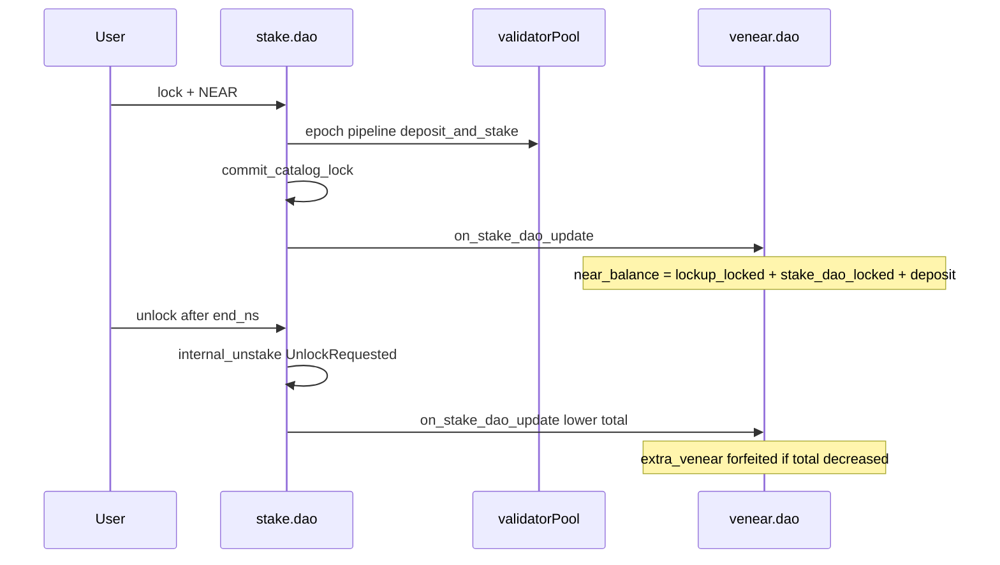

# veNEAR integration for stake.dao locks

**Status:** Design (v2)  
**Component:** `staking-contract` (`stake.dao`) + `venear-contract`  
**Supersedes:** Deferred veNEAR item in [DESIGN.md](DESIGN.md) (non-goals §1) and [PLAN.md](PLAN.md) §11.4  

**Related code:**

| Contract | Path |
|----------|------|
| stake.dao | [staking-contract/src/](../src/) — `lock.rs`, `unlock.rs`, `subscriptions.rs`, `epoch.rs` |
| veNEAR | [venear-contract/src/lockup.rs](../../venear-contract/src/lockup.rs) — `on_lockup_update`, `internal_lockup_update` |
| lockup (reference) | [lockup-contract/src/venear.rs](../../lockup-contract/src/venear.rs) — `lock_near`, `begin_unlock_near`, `venear_lockup_update` |
| shared types | [common/src/lockup_update.rs](../../common/src/lockup_update.rs) — `LockupUpdateV1`, `VLockupUpdate` |

---

## 1. Summary

This design grants **veNEAR voting power** to users who lock NEAR through `stake.dao` catalog flows (`lock`, `lock`), using the **same economics** as NEAR locked via a user lockup account: base veNEAR from locked NEAR principal, time-based extra veNEAR accrual, and forfeiture of accumulated extra veNEAR when reported locked NEAR decreases.

The integration is intentionally **minimal**: reuse `LockupUpdateV1` and mirror the lockup → veNEAR cross-contract call pattern; do not redesign the lazy epoch pipeline, share accounting, or voting contract.

**Clarification:** In `stake.dao`, “staking NEAR” means **catalog lock** (NEAR attached on lock methods, delegated to a validator pool). There is no separate bare-stake entrypoint in v1.

---

## 2. Problem and scope

### 2.1 In scope

- veNEAR updates when a user creates or changes a **catalog lock** that opts in to veNEAR registration.
- Lifecycle hooks: lock mint (`commit_catalog_lock` / `resolve_lock`), unlock (`resolve_unlock`), subscription **upgrade** (additional deposit on lock), subscription **downgrade prorate** (reduction of `Lock.amount_near`).
- veNEAR contract changes to accept a second allowlisted reporter (`stake.dao`) without breaking lockup updates.
- Migration and rollout for both contracts.

### 2.2 Out of scope

- veNEAR for NEAR that is only in `user_pending_unstake` or withdrawn but never catalog-locked.
- Generic liquid stake without catalog (future API would need its own design).
- Fungible receipt / share tokens on `stake.dao`.
- Changes to [voting-contract](../../voting-contract/) (still consumes veNEAR snapshots).
- Indexer-only or event-driven minting as the source of truth for balances.
- veNEAR delegation UX on `stake.dao` (users continue to use `venear-contract` directly).

---

## 3. Reference behavior: lockup → veNEAR

Today, veNEAR power for lockup users works as follows (see [house-of-stake-contracts/README.md](../../README.md)):

1. User **registers** on `venear-contract` (`storage_deposit`).
2. User deploys a **lockup** subaccount via veNEAR and calls `lock_near` on the lockup.
3. Lockup tracks `venear_locked_balance` and calls `venear.on_lockup_update(version, owner, update)`.
4. veNEAR updates the owner’s Merkle-tree account: `VenearBalance.near_balance` (plus storage `deposit`), accrues **extra veNEAR** over time via `VenearGrowthConfig`, and **zeros `extra_venear_balance`** when the reported locked NEAR amount **decreases**.

### 3.1 Update payload

[`LockupUpdateV1`](../../common/src/lockup_update.rs):

| Field | Role |
|-------|------|
| `locked_near_balance` | Total NEAR counted for veNEAR base (lockup: `venear_locked_balance`) |
| `timestamp` | Update time (nanoseconds) |
| `lockup_update_nonce` | Monotonic per lockup; stale updates rejected |

Wrapped as `VLockupUpdate::V1(...)`.

### 3.2 veNEAR handler (lockup path)

[`on_lockup_update`](../../venear-contract/src/lockup.rs) requires `predecessor == get_lockup_account_id(owner)` and delegates to [`internal_lockup_update`](../../venear-contract/src/lockup.rs):

- Nonce must increase.
- If new locked NEAR &lt; previous `account.balance.near_balance` → `extra_venear_balance = 0`.
- `account.balance.near_balance = near_add(lockup_update.locked_near_balance, account_internal.deposit)`.
- Global pooled totals and delegation mirrors updated.

### 3.3 Lockup owner actions

[`lockup-contract/src/venear.rs`](../../lockup-contract/src/venear.rs):

| Action | Effect on veNEAR-reported locked NEAR |
|--------|--------------------------------------|
| `lock_near` | Increase `venear_locked_balance` → `venear_lockup_update()` |
| `begin_unlock_near` | Decrease locked, move to pending → update (forfeit extra if total down) |
| `end_unlock_near` / `lock_pending_near` | Adjust pending vs locked → update |

Gas for the veNEAR call: `GAS_FOR_VENEAR_LOCKUP_UPDATE` (~20 TGas) in [lockup-contract/src/venear_ext.rs](../../lockup-contract/src/venear_ext.rs).

**stake.dao should mirror this reporter pattern**, not reimplement veNEAR math locally.

---

## 4. Architecture



### 4.1 Design principles

| Principle | Choice |
|-----------|--------|
| Source of truth | **Direct** cross-contract calls from `stake.dao` to veNEAR (same as lockup) |
| Payload type | Reuse `VLockupUpdate` / `LockupUpdateV1` — **no new common type** |
| Reporter trust | veNEAR allowlists `stake.dao` account id in config |
| Billing vs governance | Catalog `end_ns` gates **unlock**; veNEAR drop aligns with **`unlock()`** (like `begin_unlock_near`), not `withdraw()` |
| Integration default | **Opt-in per lock** (`register_with_venear`, default `false`) for migration safety |

Existing `lock_create` events remain for indexers; they are **not** sufficient for balance updates.

---

## 5. Locked NEAR accounting (principal model)

### 5.1 Definition

For a user `account_id`:

```text
stake_dao_locked(account_id) =
  Σ lock.amount_near
  for all locks where
    lock.account_id == account_id
    AND lock.status == Active
    AND lock.register_with_venear == true
```

`stake.dao` reports `stake_dao_locked` to veNEAR on each material change.

### 5.2 Principal vs mark-to-market

| Model | Pros | Cons |
|-------|------|------|
| **Principal** (`Lock.amount_near`) | Matches lockup’s explicit `venear_locked_balance`; O(1) aggregate; no extra pool views | Ignores slash-induced share value loss (already documented for locks) |
| Mark-to-market (`near_for(shares)` per lock) | Economically “true” staked value | Extra `get_account` calls; async pipeline coupling; diverges from lockup semantics |

**Decision:** use **principal** for veNEAR base NEAR.

Slashing: locks keep share count; `near_for(shares)` can fall while `amount_near` is unchanged — same class of risk as lockup NEAR staked in pools without reducing `venear_locked_balance`.

### 5.3 On-chain aggregate (stake.dao)

Maintain incrementally (avoid scanning all locks):

```text
user_venear_locked: LookupMap<AccountId, u128>   // yoctoNEAR
stake_dao_venear_nonce: LookupMap<AccountId, u64> // per-user nonce for veNEAR updates
```

| Event | Delta to `user_venear_locked` |
|-------|-------------------------------|
| `commit_catalog_lock` with `register_with_venear` | `+ lock.amount_near` |
| `resolve_unlock` for opt-in lock | `- lock.amount_near` |
| Subscription upgrade (deposit on lock) | `+` top-up amount |
| Downgrade prorate (reduces `lock.amount_near`) | `-` prorated reduction |

Locks in `UnlockRequested` or `Withdrawn` do not count (removed at unlock).

---

## 6. stake.dao changes

### 6.1 Configuration

[`config.rs`](../src/config.rs):

```rust
pub venear_account_id: Option<AccountId>,
```

- Set by contract owner after veNEAR deploy (`set_venear_account_id`).
- If `None`, veNEAR integration is disabled (v1 behavior).

### 6.2 Lock type

[`types.rs`](../src/types.rs) — extend `Lock`:

```rust
pub register_with_venear: bool,  // default false on migrate
```

Expose optional argument on:

- `lock(..., register_with_venear: Option<bool>)`
- `lock(..., register_with_venear: Option<bool>)`

Default: `false` (recommended for rollout).

### 6.3 New module `venear.rs`

Patterned on [lockup-contract/src/venear.rs](../../lockup-contract/src/venear.rs):

- `ext_venear` contract trait: `on_stake_dao_update(owner_account_id, update: VLockupUpdate)`
- `GAS_FOR_VENEAR_STAKE_DAO_UPDATE` ≈ 20 TGas (same as lockup)
- `fn venear_stake_dao_update(&mut self, owner: AccountId) -> Promise`
  - Increments per-user nonce in `stake_dao_venear_nonce`
  - Sends `VLockupUpdate::V1(LockupUpdateV1 { locked_near_balance, timestamp, lockup_update_nonce })`
  - `locked_near_balance` = `user_venear_locked[owner]`

Register module in [`lib.rs`](../src/lib.rs).

### 6.4 Hook points

| Location | When to call veNEAR |
|----------|---------------------|
| [`lock.rs`](../src/lock.rs) — `resolve_lock` | After successful `commit_catalog_lock`, if lock opted in and `venear_account_id` set |
| [`unlock.rs`](../src/unlock.rs) — `resolve_unlock` | After `internal_unstake` + status `UnlockRequested`, if lock had opt-in |
| [`subscriptions.rs`](../src/subscriptions.rs) | Upgrade tail: increase aggregate by deposit delta; downgrade prorate: decrease by NEAR removed from lock |

Chain the veNEAR promise **after** the epoch pipeline tail succeeds (fire-and-forget, same as lockup’s `venear_lockup_update()` at end of `lock_near`). Extend [`gas.rs`](../src/gas.rs) callback budgets (`ON_LOCK_FINALLY_MINT`, `ON_UNLOCK_TAIL_AFTER_PRE_USER`) if the promise is attached in the release callback chain.

### 6.5 Unlock timing vs veNEAR

| stake.dao step | veNEAR effect |
|----------------|---------------|
| `unlock()` at `now >= end_ns` | Report **lower** `stake_dao_locked` (like `begin_unlock_near`) |
| Pool unstake / `withdraw()` | **No** additional veNEAR change (pending unstake not counted, like lockup pending) |

### 6.6 Failure policy

- **Lock/unlock must not revert** if the veNEAR promise fails (lockup does not roll back `lock_near` on veNEAR failure either).
- Emit `venear_sync_failed` event (account, nonce, intended balance) for monitoring.
- Optional repair: `sync_venear(account_id)` — owner or user recomputes aggregate from locks and pushes update (see §11).

### 6.7 User prerequisites

1. Register on veNEAR: `storage_deposit` on `venear-contract`.
2. Opt in on lock: `register_with_venear: true`.

When (2) without (1): **require** at lock entry (cross-contract view or explicit check) — recommended to fail fast with a clear error rather than silent skip.

---

## 7. venear-contract changes

### 7.1 Configuration

[`venear-contract/src/config.rs`](../../venear-contract/src/config.rs):

```rust
pub stake_dao_account_id: Option<AccountId>,
```

Owner sets after `stake.dao` deployment. `on_stake_dao_update` requires `env::predecessor_account_id() == stake_dao_account_id`.

### 7.2 AccountInternal split

Today `internal_lockup_update` sets:

```text
near_balance = lockup_reported_locked + deposit
```

which **overwrites** the full base NEAR on every lockup update. Adding stake.dao requires **separate stored components**:

```rust
pub struct AccountInternal {
    pub lockup_version: Option<Version>,
    pub deposit: NearToken,
    pub lockup_update_nonce: U64,
    pub lockup_locked_near: NearToken,       // NEW — migrated from tree
    pub stake_dao_locked_near: NearToken,    // NEW
    pub stake_dao_update_nonce: U64,         // NEW
}
```

Recompute on any update:

```text
account.balance.near_balance =
  near_add(near_add(lockup_locked_near, stake_dao_locked_near), deposit)
```

Refactor `internal_lockup_update` into a shared helper, e.g. `internal_apply_locked_near_update(source, owner, update)`:

- **Lockup:** update `lockup_locked_near` + `lockup_update_nonce`; preserve `stake_dao_locked_near`.
- **Stake.dao:** update `stake_dao_locked_near` + `stake_dao_update_nonce`; preserve `lockup_locked_near`.

Retain existing rules: nonce monotonicity, extra veNEAR forfeit when **total** base NEAR (after recompute) decreases vs previous `account.balance` before update, delegation/global state propagation unchanged.

### 7.3 New public method

```rust
pub fn on_stake_dao_update(
    &mut self,
    owner_account_id: AccountId,
    update: VLockupUpdate,
)
```

- Require owner registered (`internal_get_account_internal`).
- Require `stake_dao_account_id` configured.
- Match `VLockupUpdate::V1` and call shared internal helper with source = StakeDao.

### 7.4 Double-counting policy

For users with **both** lockup and stake.dao:

```text
effective_locked_for_venear = lockup_locked_near + stake_dao_locked_near + deposit
```

- Lockup reports only `venear_locked_balance`.
- stake.dao reports only catalog opt-in locks.
- **Operational policy:** the same NEAR must not be intentionally locked in both systems for voting power; governance/docs should state this clearly.

---

## 8. Parity matrix: lockup vs stake.dao

| Behavior | Lockup | stake.dao (this design) |
|----------|--------|-------------------------|
| Base veNEAR from | `venear_locked_balance` | Σ active opt-in `Lock.amount_near` |
| Extra veNEAR growth | Global `VenearGrowthConfig` | Same |
| Forfeit extra on decrease | `begin_unlock_near` (and any locked decrease) | `unlock()` |
| Pending / unstaking NEAR | Not in veNEAR locked total | `user_pending_unstake` not counted |
| Time gate before exit | `unlock_duration_ns` (veNEAR pending bucket) | Catalog `end_ns` (billing only) |
| Reporter contract | User lockup subaccount | `stake.dao` allowlisted |
| Pool staking | Optional inside lockup | Required for catalog lock |
| Per-lock opt-in | N/A (whole lockup account) | `register_with_venear` per lock |

---

## 9. Migration and rollout

### 9.1 veNEAR upgrade

1. Add `AccountInternal` fields; migrate existing accounts:
   - `lockup_locked_near` ← reconstruct from current `account.balance.near_balance - deposit` (stake_dao_locked_near = 0).
   - `stake_dao_update_nonce` = 0.
2. Deploy `on_stake_dao_update`; `stake_dao_account_id = None` until linked.

### 9.2 stake.dao upgrade

1. Add `venear_account_id`, `register_with_venear` (default false), maps `user_venear_locked`, `stake_dao_venear_nonce`.
2. veNEAR hooks no-op until `venear_account_id` is set.

### 9.3 Linking (owner)

1. Set `venear.config.stake_dao_account_id = stake.dao`.
2. Set `stake.dao.config.venear_account_id = venear.dao`.

### 9.4 User-facing rollout

1. Register on veNEAR (`storage_deposit`).
2. Lock on stake.dao with `register_with_venear: true`.
3. Unlock after `end_ns` to reduce veNEAR (same as beginning unlock on lockup).

---

## 10. Testing checklist

| Scenario | Expected |
|----------|----------|
| Lock with opt-in, registered on veNEAR | `user_venear_locked` increases; veNEAR base NEAR increases; extra accrues over time |
| `unlock()` on opt-in lock | veNEAR base decreases; extra veNEAR forfeited |
| User with lockup + stake.dao | Lockup update does not zero stake.dao component; totals additive |
| Stale / replay nonce | veNEAR rejects update |
| Opt-in lock, not registered on veNEAR | Lock fails at entry (if check enabled) |
| veNEAR promise fails after lock commits | Lock exists; `venear_sync_failed` emitted; `sync_venear` repairs |
| Subscription upgrade / downgrade prorate | Aggregate and veNEAR update match `amount_near` delta |
| `register_with_venear: false` | No veNEAR calls; aggregate unchanged |

Suggested locations: extend [integration-tests](../../integration-tests/) (venear + stake.dao), unit tests on aggregate math, sandbox tests following [tests/sandbox_epoch_settlement.rs](../tests/sandbox_epoch_settlement.rs) patterns.

---

## 11. Open questions (for review)

1. **Opt-in default**  
   - **Recommended:** per-lock `register_with_venear`, default `false`.  
   - Alternatives: account-level `venear_enabled` on stake.dao `Account`; or default-on for all locks (stronger product signal, more registration friction).

2. **Registration check timing**  
   - Fail at lock entry with cross-contract `get_account_info` vs allow lock and fail async on veNEAR (worse UX).

3. **`sync_venear` permissions**  
   - Public (anyone can repair desync) vs owner-only vs lock owner only.

4. **Events**  
   - Whether to extend `lock_create` JSON with `register_with_venear` for indexers (non-authoritative).

5. **Governance disclosure**  
   - README/DESIGN slashing note: veNEAR principal may exceed pool mark-to-market after slash.

---

## 12. Implementation checklist (engineering)

- [ ] `common`: no change (reuse `LockupUpdateV1`)
- [ ] `venear-contract`: config, `AccountInternal`, migration, `on_stake_dao_update`, refactor `internal_lockup_update`
- [ ] `staking-contract`: config, `Lock`, maps, `venear.rs`, hooks, gas, governance setter, tests
- [ ] `docs`: update [DESIGN.md](DESIGN.md) architecture diagram when implemented; [API.md](API.md) new methods/args
- [ ] Deploy scripts: link `stake_dao_account_id` / `venear_account_id` in [scripts/deploy_all.sh](../../scripts/deploy_all.sh)

---

## Appendix: deferred v1 seam (now specified)

[PLAN.md](PLAN.md) §11.4 originally proposed:

- `lock_create` / `unlock_settled` events for veNEAR consumption
- `register_with_venear: bool` on `Lock`

This design **keeps** `register_with_venear` and events for observability, but specifies **direct `on_stake_dao_update` calls** as the authoritative balance path, matching production lockup behavior.
